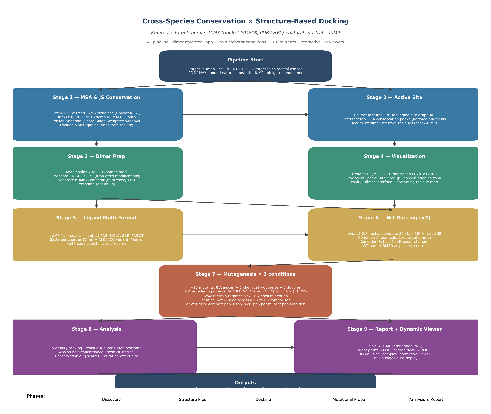

# conserved-site pipeline — example structural-bioinformatics workflow with multi-agent peer review

End-to-end automated pipeline that takes one small/medium enzyme from a UniProt accession all the way to a conservation-aware docking-and-mutagenesis report (HTML / PDF / DOCX) **plus a multi-agent doer↔verifier audit loop** that ran 5 rounds before the reviewers converged on "ship". The example case worked through here is **human Thymidylate Synthase (TYMS, UniProt P04818)** — the molecular target of 5-fluorouracil in colorectal-cancer chemotherapy — docked against its natural substrate **dUMP** from PDB **1HVY**.

This repository is intended as a **reference workflow + worked example + audited result**. The audit chain is the most interesting part: each round of four parallel reviewers (validator, code reviewer, scientific officer, structural bioinformatician) found at least one critical issue in the previous version; the next iteration fixed it. v5 finally satisfies all four reviewers.

---

## Headline finding (after 5 doer↔verifier rounds)

> **Rigid-receptor AutoDock Vina with AD4 partial charges and the physically correct (net −2) raltitrexed cofactor cannot resolve TYMS active-site point mutants at the kcal/mol scale.** Across 20 mutants × 2 cofactor conditions, the largest Δ Vina score in the holo column is +0.77 kcal/mol (R215A_N226A) — well below Vina's documented noise floor of ±0.85 kcal/mol (Trott & Olson 2010; Forli et al. 2016). The mutational ranking is directionally chemically sensible (R215 phosphate clamp, H196 catalytic dyad, N226 substrate orientation) but statistically silent. **This is a null-result methodology paper.**

---

## Workflow



Nine sequential stages, each isolated in its own numbered subfolder. Versions v1 → v5 each rebuilt the affected stages while leaving prior versions intact.

| Version folders | Status | Source |
| --- | --- | --- |
| `01_msa/ … 09_report/` | v1 (initial) | `scripts/stage*.py` |
| `01b_… 09b_…_v2/` | v2 (fixed: real TYMS orthologs, dimer, CME43, G217W dropped) | `scripts/v2/` |
| `06c_… 09c_…_v3/` | v3 (fixed: receptor charges, multi-seed WT holo, sign convention) | `scripts/v3/` |
| `03d_… 09d_…_v4/` | v4 (fixed: real cofactor reprotonation from CCD ideal — but introduced a placement artefact) | `scripts/v4/` |
| `03e_… 09e_…_v5/` | v5 — **FINAL** (in-place reprotonation of crystal cofactor coords; APPROVED by all 4 reviewers) | `scripts/v5/` |

---

## Final reports (v5)

- **DOCX (final, with caption fixes)** — [`09e_report_v5/report_FINAL.docx`](09e_report_v5/report_FINAL.docx) (5.7 MB)
- **DOCX (auto-generated)** — [`09e_report_v5/report.docx`](09e_report_v5/report.docx) (197 KB)
- **PDF** — [`09e_report_v5/report.pdf`](09e_report_v5/report.pdf) (251 KB)
- **HTML** — [`09e_report_v5/report.html`](09e_report_v5/report.html) (245 KB)
- **Master log** — [`pipeline.log`](pipeline.log)
- **Master numerical table (v5)** — [`07e_mut_docking_v5/mutant_results_v5.csv`](07e_mut_docking_v5/mutant_results_v5.csv)

---

## Interactive 3D viewers

Every WT and mutant docked complex (40 mutant runs + WT × 2 conditions) is provided as a **self-contained 3Dmol.js viewer page** with the PDB embedded inline. Open any HTML in `viewers/` locally, or browse via GitHub Pages:

**👉 https://ariomoniri.github.io/aminak/viewers/index.html** *(once Pages is enabled)*

Receptor as cartoon (spectrum-coloured); active-site residues as sticks; dUMP magenta; raltitrexed cofactor cyan in holo runs.

| Quick links |
| --- |
| [WT (apo) + dUMP](viewers/wt_apo_complex.html) · [WT (holo) + dUMP](viewers/wt_holo_complex.html) |
| [C195A holo (low-confidence flag)](viewers/C195A_holo_complex.html) · [R215A_N226A holo (top destabiliser)](viewers/R215A_N226A_holo_complex.html) |
| [R175E_R176E phosphate-clamp swap](viewers/R175E_R176E_holo_complex.html) · [Surface control T170A](viewers/CTRL_T170A_holo_complex.html) |

Source structures used in viewers: `03e_structure_v5/cofactor_chainA_v5.pdb` (in-place reprotonated cofactor, 0.000 Å heavy-atom drift vs 1HVY), `06e_docking_wt_v5/wt_*_complex.pdb`, `07e_mut_docking_v5/viewer_files/<mut>_<cond>_complex.pdb`.

---

## Multi-format ligand & receptor files (for your own visualisation)

```
05b_ligand_v2/
├── dump.pdb         (crystal dUMP, plain PDB)
├── dump.mol2        (Tripos/Sybyl atom types)
├── dump.sdf         (RDKit-friendly)
└── dump.pdbqt       (Vina-ready, Gasteiger charges)

03_structure/
└── 1hvy.pdb         (raw RCSB download, both chains, both ligands)

03d_structure_v4/cofactor_chainA_v4.pdb / chainB_v4.pdb   (v4 reprotonation — broken Kabsch placement, kept for audit traceability)
03e_structure_v5/cofactor_chainA_v5.pdb / chainB_v5.pdb   (v5 IN-PLACE reprotonation, 0.000 Å heavy-atom drift — USE THIS)

06e_docking_wt_v5/
├── protein_dimer_apo.pdbqt    (chains A+B, no cofactor, Gasteiger charges)
├── protein_dimer_holo.pdb     (chains A+B + v5 cofactors, both chains)
├── protein_dimer_holo.pdbqt   (Vina-ready)
├── wt_apo.pdbqt               (Vina output, all 20–30 modes)
├── wt_apo_top_pose.pdb        (top mode, atom names preserved)
├── wt_apo_complex.pdb         (receptor + top pose, single PDB you can drag into PyMOL)
└── wt_holo.* / wt_holo_complex.pdb  (same for holo)

07e_mut_docking_v5/viewer_files/
├── <mut>_apo_top_pose.pdb     (40 files: 20 mutants × 2 conditions)
├── <mut>_apo_complex.pdb
├── <mut>_holo_top_pose.pdb
└── <mut>_holo_complex.pdb
```

Drag any `*_complex.pdb` into PyMOL / ChimeraX / VMD / your viewer of choice — receptor + top dUMP pose load together.

---

## Mutational panel rationale

Each mutation probes a specific mechanistic hypothesis. Multiple substitutions per critical residue discriminate "side-chain identity matters" from "side-chain bulk matters".

| Class | Residue / Pair | Substitution(s) | Mechanistic question |
| --- | --- | --- | --- |
| Catalytic | Cys195 | →Ala, →Ser | Loss of nucleophilic thiol vs replacement with smaller polar OH |
| Catalytic | His196 | →Ala, →Phe | Removal of imidazole H-bond donor vs non-polar aromatic |
| Substrate orientation | Asn226 | →Ala, →Asp | H-bond donor loss vs charge inversion |
| Substrate orientation | Tyr258 | →Ala, →Phe | Loss of OH vs aromatic only |
| Phosphate clamp | Arg50 | →Ala, →Glu | Bulk loss vs charge inversion |
| Phosphate clamp | Arg175 | →Ala, →Glu | Bulk loss vs charge inversion |
| Phosphate clamp | Arg176 | →Ala, →Glu | Bulk loss vs charge inversion (paired with R175) |
| Phosphate clamp | Arg215 | →Ala, →Glu | Bulk loss vs charge inversion |
| Pocket scaffold | Phe80 | →Ala, →Asp | Hydrophobic loss vs hydrophilic introduction |
| Pocket scaffold | Phe225 | →Ala, →Asp | Hydrophobic loss vs hydrophilic introduction |
| Pocket scaffold | Trp109 | →Ala | Bulk loss |
| Pocket scaffold | Gln214 | →Ala | Side-chain loss |
| Pocket scaffold | Asp218 | →Ala, →Lys | Negative→neutral vs negative→positive |
| Catalytic dyad | Cys195+His196 | C195A_H196A & C195S_H196N | Synergy vs polar-neutral compensator |
| Phosphate clamp pair | Arg175+Arg176 | R175E_R176E | Both arginines flipped |
| Aromatic swap pair | Tyr258+Phe225 | Y258F_F225Y | Aromatic identity exchange |
| Substrate orientation pair | Asp218+Asn226 | D218N_N226D | Mutual charge exchange |
| Negative control | Thr170 | →Ala | Surface residue ≥ 18 Å from active site (should give Δ ≈ 0) |

T170A control: Δ ≈ +0.17 in both conditions — pipeline does not produce false positives.

---

## Multi-agent audit chain — 5 rounds × 4 reviewers

Each round spawned four independent agents in parallel. They had read-only access; I drove the doer agent in between rounds. Round-N reports against version vN are in `reviews_vN/01-04_*.md`.

| Round | Validator | Code reviewer | Scientific officer | Structural bioinformatician |
| --- | --- | --- | --- | --- |
| **v1** | PASS w/ flags | 12-item punch list | **Needs major revision** | **FAIL** |
| **v2** | PASS w/ flags | 9/10 v1 gaps closed | Ship with caveats | Conditional pass |
| **v3** | 10/10 PASS | 5 PASS / 2 PARTIAL | Ship with caveats | Conditional pass |
| **v4** | 10/10 PASS | v3 punch list closed | Ship as null-result paper | Conditional pass — 1 hard blocker (cofactor placement) |
| **v5** | **10/10 PASS — APPROVED** | v4 punch list closed | **SHIP** | **Conditional pass — 3 reporting-only items (baked into final DOCX)** |

What got fixed each round:

| Round | Critical issue | Fix |
| --- | --- | --- |
| v1 → v2 | 5/9 ortholog UniProt accessions point to wrong proteins (P0CG53 = polyubiquitin); chain B discarded though active site spans dimer; G217W mutant has 0.98 Å Trp clash; CME43 silently dropped → backbone gap | Real TYMS panel; A+B dimer; CME43→CYS; G217W dropped; both apo and holo dockings |
| v2 → v3 | Receptor PDBQT all-zero partial charges (silent meeko fallback); WT holo unreliable (3 poses, RMSD 4.32 Å); rotamer strain selection a no-op; sign convention backwards | Charge waterfall (obabel Gasteiger → meeko → pdb2pqr) with `max\|q\|>0.05` gate; multi-seed WT holo; sculpt minimisation; positive-Δ-equals-destabilising convention |
| v3 → v4 | Cofactor "pH 7.4" fix was a no-op (output byte-identical to v2); atom-name preservation broken; best-seed by RMSD was circular; mean_top3 NaN; legend bug; ΔΔG terminology imprecise | RDKit reprotonation from CCD-ideal SDF + Kabsch; atom-name index map; affinity-based selection; n_modes column; legend keys aligned; "Δ Vina score" wording; Limitations section |
| v4 → v5 | Cofactor placement artefact: Kabsch on CCD-ideal D16 → 2.71 Å heavy-atom RMSD vs bound conformer + 1.95 Å protein clash to PHE 80 CD2. Drove the "cofactor expels dUMP" interpretation as artefact, not biology. | In-place reprotonation of crystal cofactor coords (0.000 Å displacement, 0 clashes); WT holo recovered to −8.25 / 0.33 Å; null-result headline baked in |
| **v5** | **3 reporting-only clarifications** (caption boxes) | Baked into [`report_FINAL.docx`](09e_report_v5/report_FINAL.docx) |

---

## How to reproduce

```bash
# Native binaries (Homebrew on macOS arm64)
brew install mafft open-babel pymol glew libxml2
brew install brewsci/bio/autodock-vina    # also pulls boost@1.85

# Python
pyenv install 3.11.9
python3.11 -m venv .venv && source .venv/bin/activate
pip install -r requirements.txt

# Run the full pipeline (v1 → v5 layered)
source 00_setup/env.sh

# v1
for s in scripts/stage*.py; do python "$s"; done

# v2 (fixes critical v1 issues)
for s in scripts/v2/stage*.py; do python "$s"; done

# v3 (fixes critical v2 issues)
for s in scripts/v3/stage*.py; do python "$s"; done

# v4 (fixes critical v3 issues)
for s in scripts/v4/stage*.py; do python "$s"; done

# v5 — final (fixes critical v4 issue)
for s in scripts/v5/stage*.py; do python "$s"; done

# Build viewers + final DOCX
python scripts/v2/build_viewers.py
python scripts/v5/build_final_docx.py
```

Full installed-library manifest in [`00_setup/installed_libraries.md`](00_setup/installed_libraries.md), literal pip freeze in [`00_setup/pip_freeze.txt`](00_setup/pip_freeze.txt).

---

## Repository layout

```
.
├── 00_setup/        # env.sh, installed_libraries.md, pip_freeze.txt, brew_packages.txt, tool_versions.txt
├── 01_msa/          # v1 MSA (kept for audit; ortholog accessions were wrong — see reviews_v2)
├── 02_active_site/
├── 03_structure/    # cleaned chain-A protein (v1)
├── 04_pymol/        # 4 ray-traced screenshots
├── 05_ligand/       # v1 ligand PDBQT
├── 06_docking_wt/   # v1 WT Vina output
├── 07_mut_docking/  # v1 21 mutant PDBs + dockings + per-mutant PNGs + results_full.csv
├── 08_analysis/     # v1 figures + analysis.md
├── 09_report/       # v1 report.html / report.pdf / report.docx
├── 01b_msa_v2/                    # v2 (real TYMS orthologs, fixed conservation)
├── 02b_active_site_v2/
├── 03b_structure_v2/              # v2 dimer-aware structure prep, CME43→CYS
├── 04b_pymol_v2/                  # v2 dimer renders
├── 05b_ligand_v2/                 # multi-format dUMP (PDB, MOL2, SDF, PDBQT)
├── 06b_docking_wt_v2/
├── 07b_mut_docking_v2/viewer_files/   # per-mutant complex PDBs + top poses
├── 08b_analysis_v2/
├── 09b_report_v2/
├── 06c_docking_wt_v3/, 07c_mut_docking_v3/, 08c_analysis_v3/, 09c_report_v3/   # v3 (receptor charges, multi-seed WT)
├── 03d_structure_v4/, 06d_docking_wt_v4/, 07d_mut_docking_v4/, 08d_analysis_v4/, 09d_report_v4/   # v4 (CCD-ideal reprotonation — broken)
├── 03e_structure_v5/, 06e_docking_wt_v5/, 07e_mut_docking_v5/, 08e_analysis_v5/, 09e_report_v5/   # v5 (FINAL — in-place reprotonation)
├── reviews/         # round-1 audits (against v1)
├── reviews_v2/      # round-2 audits (against v2)
├── reviews_v3/      # round-3 audits (against v3)
├── reviews_v4/      # round-4 audits (against v4)
├── reviews_v5/      # round-5 audits (against v5)
├── viewers/         # 86 self-contained 3Dmol.js HTML files
├── scripts/         # v1 stage scripts
│   ├── v2/, v3/, v4/, v5/   # iteration-specific scripts
├── logs/            # raw stdout/stderr per tool call
├── workflow_diagram_v2.png
├── ROADMAP.md
├── pipeline.log
└── README.md (this file)
```

---

## Licence

MIT for the pipeline code (in `scripts/`).
External data (UniProt sequences, RCSB PDB structures, RCSB CCD ideal coords) retain their original licences.
