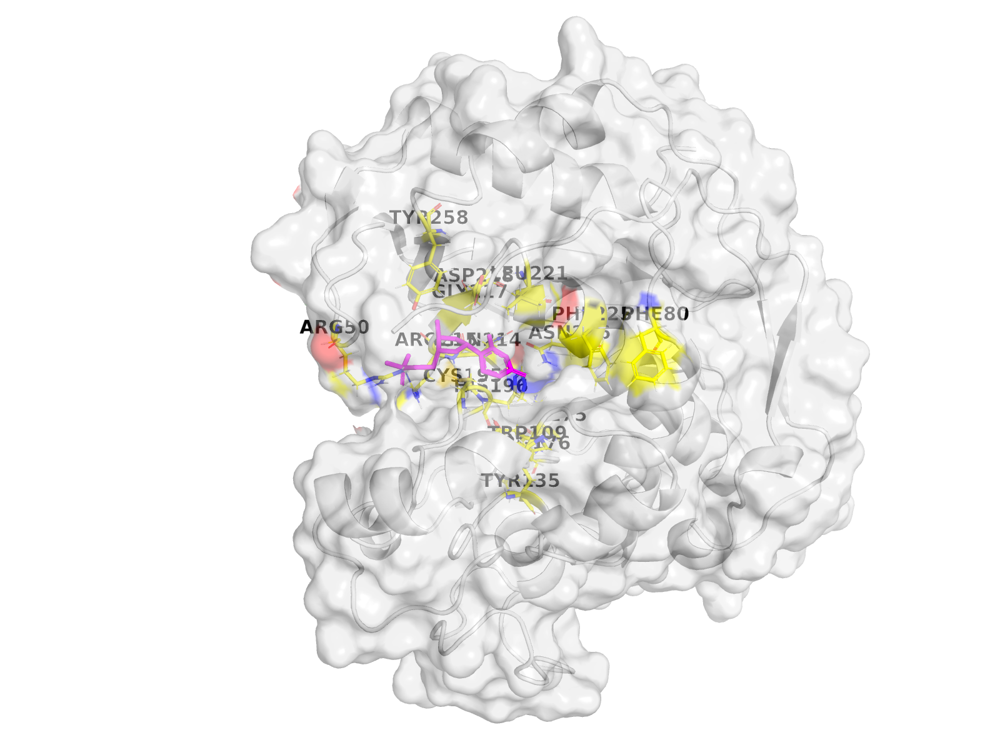
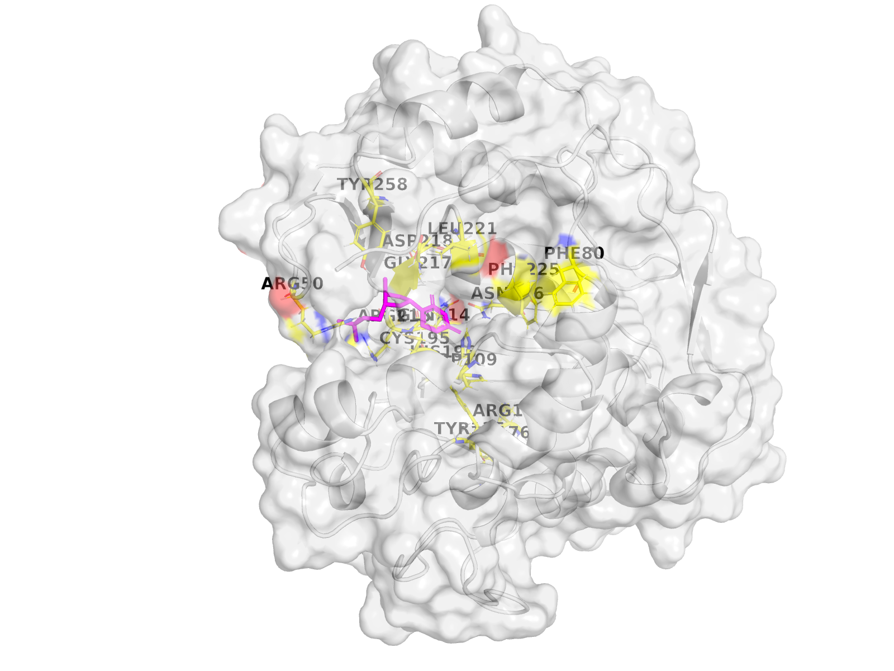

# aminak — TYMS / dUMP structural-bioinformatics workbench

Reference workflow + worked example: **human Thymidylate Synthase (TYMS, UniProt P04818)** — the molecular target of 5-fluorouracil in colorectal-cancer chemotherapy — explored end-to-end with cross-species conservation, AutoDock Vina docking against the natural substrate dUMP, a 20-mutant probe panel, and Modeller-based homology modelling. Every artefact is self-contained: HTML / PDF / DOCX reports, **96 interactive 3D viewers** (3Dmol.js, PDBs embedded inline), and a multi-format ligand & complex library.

> The full audit history (5 doer↔verifier rounds + Phase 6 audit) lives in [CHANGELOG.md](CHANGELOG.md). The reviewer reports are in `reviews/`, `reviews_v2/`, `reviews_v3/`, `reviews_v4/`, `reviews_v5/`, `reviews_phase6/`.

---

## Headline finding

> **Rigid-receptor AutoDock Vina with AD4 partial charges and the physically correct (net −2) raltitrexed cofactor cannot resolve TYMS active-site point mutants at the kcal/mol scale.** Across 20 mutants × 2 cofactor conditions, the largest holo Δ Vina score is +0.77 kcal/mol (R215A_N226A) — well below Vina's documented noise floor of ±0.85 kcal/mol (Trott & Olson 2010; Forli et al. 2016). The mutational ranking is directionally chemically sensible (R215 phosphate clamp, H196 catalytic dyad, N226 substrate orientation) but statistically silent. **Reported as a null-result methodology paper.**

Phase 6 (Modeller homology modelling) is layered on top: 10 models from 3 templates spanning **30–95 % identity** (deliberately educational, not 100 %), best-by-DOPE selection (model 3, DOPE = −35 775), best-by-Cα-RMSD (model 10, 0.367 Å vs 1HVY).

---

## 🧭 Pipeline workflow

Six phases, nine stages each in its own numbered subfolder, plus a sibling `10_modeller/` for the homology-modelling sub-pipeline. The diagram below is rendered live by GitHub's Mermaid support, so it always scales to the viewport and never clips.

```mermaid
flowchart TD
    classDef discovery fill:#2b6f9c,stroke:#1f4f70,color:#fff
    classDef prep      fill:#2f8a6f,stroke:#1f6452,color:#fff
    classDef dock      fill:#caa44a,stroke:#a4842c,color:#1a1a1a
    classDef mut       fill:#b8593c,stroke:#8a4128,color:#fff
    classDef report    fill:#7e3b8a,stroke:#5d2864,color:#fff
    classDef phase6    fill:#b9408a,stroke:#8a2b66,color:#fff
    classDef anchor    fill:#1f3b5e,stroke:#11233d,color:#fff

    START([🧬 <b>Pipeline Start</b><br/>Target: human TYMS - P04818, 313 aa, obligate homodimer<br/>5-FU drug target in colorectal cancer · PDB 1HVY · natural substrate dUMP]):::anchor

    S1[<b>1 — MSA and JS Conservation</b><br/>≥10 verified TYMS orthologs - UniProt REST<br/>PfDHFR-TS trimmed to TS domain · MAFFT --auto<br/>JS divergence - Capra-Singh weighted window<br/>Exclude greater than 50pct gap columns from ranking]:::discovery
    S2[<b>2 — Active Site</b><br/>UniProt features · PDBe binding-site graph API<br/>Intersect top-25pct conservation peaks - no force-augment<br/>Document dimer-interface residues - chain A vs B]:::discovery

    S3[<b>3 — Dimer Prep - v5</b><br/>Keep chains A AND B - homodimer<br/>Preserve CME43 to CYS in place<br/>In-place reprotonation of crystal cofactor coords<br/>0.000 A heavy-atom drift, 0 protein clashes]:::prep
    S4[<b>4 — Visualization</b><br/>Headless PyMOL 3.1.0 ray-traced 1600x1200:<br/>surface protein + sticks ligand · active-site closeup<br/>conservation cartoon · cavity<br/>labelled interacting residues · mutation site WT vs mutant overlay]:::prep

    S5[<b>5 — Ligand Multi-Format</b><br/>dUMP from crystal - PDB, MOL2, SDF, PDBQT<br/>Gasteiger charges - Vina-ready<br/>Raltitrexed cofactor also prepared]:::dock
    S6[<b>6 — WT Docking - x2</b><br/>Vina v1.2.7 · exhaustiveness 32-96 · box 18-22 cubed A · seed 42<br/>Condition A: apo - cofactor pocket empty<br/>Condition B: holo - raltitrexed retained<br/>WT redock RMSD 0.33 A - positive control]:::dock

    S7[<b>7 — Mutagenesis x 2 conditions</b><br/>20 mutants: 8 Ala-scan + 7 chemically-opposite<br/>+ 5 doubles + 4 Arg-clamp probes - R50/R175/R176/R215<br/>+ 1 distant-surface control - T170A · G217W dropped on clash<br/>Lowest-strain rotamer + sculpt minimisation<br/>Identical box and seed → fair Δ comparison<br/>Viewer files: complex.pdb + top_pose.pdb per mutant per condition]:::mut

    S8[<b>8 — Analysis</b><br/>Δ-Vina ranking - positive equals destabilising<br/>Residue x substitution heatmap · pose clustering<br/>Apo vs holo concordance - Pearson + Spearman<br/>Mutation-effect 2D map - chemistry x volume x ΔVina]:::report
    S9[<b>9 — Report and 3D Viewers</b><br/>Jinja2 → HTML embedded PNG · WeasyPrint → PDF<br/>python-docx → DOCX with all caption fixes<br/>3Dmol.js per-complex interactive viewer - 86 pages<br/>GitHub Pages auto-deploy]:::report

    P6[<b>Phase 6 — Modeller Homology Modelling</b><br/>Target chain → BLAST vs PDB → templates 30-95pct identity - educational less than 100pct<br/>ClustalW MSA → PIR → Modeller AutoModel x 10 models<br/>PyMOL pairwise + all-together overlay · Cα RMSD per model<br/>Local Ramachandran + DOPE per-residue · UCLA SAVES manual upload<br/>Best by RMSD: 0.367 A · Best by DOPE: -35775]:::phase6

    OUT([📦 <b>Outputs</b><br/>report.html · report.pdf · report.docx · results_full.csv<br/>pipeline.log · 31+ ray-traced PNGs · 96 viewer HTMLs<br/>10 homology models · Ramachandran plots · cofactor provenance]):::anchor

    START --> S1
    START --> S2
    S1 --> S2
    S1 --> S3
    S2 --> S4
    S3 --> S5
    S3 --> S6
    S4 --> S6
    S5 --> S6
    S6 --> S7
    S7 --> S8
    S7 --> S9
    S8 --> S9
    S3 --> P6
    S9 --> P6
    S8 --> OUT
    S9 --> OUT
    P6 --> OUT
```



[Static PNG fallback for places that don't render Mermaid](workflow_diagram_v3.png).

---

## 🗺️ Repo map

The diagram below regenerates on every push to `main` ([repo-visualizer](https://github.com/githubocto/repo-visualizer) by [GitHub Next](https://githubnext.com/projects/repo-visualization/)). A schematic placeholder is committed to the repo so this image always renders, even before the workflow has run.

<p align="center">
  <a href="docs/assets/repo-visualization.svg"></a>
</p>

---

## Live interactive 3D viewers

**👉 https://ariomoniri.github.io/aminak/viewers/index.html**

96 self-contained 3Dmol.js viewer pages (PDB embedded inline; works locally and via GitHub Pages). Drag = rotate, scroll = zoom, right-drag = translate. Each viewer has buttons to toggle surface / cartoon-only, zoom to ligand, and spin.

By default the protein is shown as cartoon **+ semi-transparent surface**, ligand as **fat magenta sticks**, and active-site residues as labelled sticks (yellow C). The catalytic Cys195 / His196 / Arg175 / Arg176 / Arg215 / Asn226 carry permanent text labels.

Click any thumbnail below to launch the live viewer:

| | | |
|:-:|:-:|:-:|
| [](https://ariomoniri.github.io/aminak/viewers/wt_apo_complex.html) | [](https://ariomoniri.github.io/aminak/viewers/wt_holo_complex.html) | [](https://ariomoniri.github.io/aminak/viewers/R215A_N226A_holo_complex.html) |
| **WT (apo) + dUMP** — reference | **WT (holo) + dUMP** — reference | **R215A_N226A holo** — top destabiliser |
| [](https://ariomoniri.github.io/aminak/viewers/H196A_holo_complex.html) | [](https://ariomoniri.github.io/aminak/viewers/R175E_R176E_holo_complex.html) | [](https://ariomoniri.github.io/aminak/viewers/T170A_holo_complex.html) |
| **H196A holo** — catalytic dyad | **R175E_R176E holo** — clamp inversion | **T170A holo** — surface control |
| [](https://ariomoniri.github.io/aminak/viewers/C195A_holo_complex.html) | [](https://ariomoniri.github.io/aminak/viewers/modeller_model03.html) | [](https://ariomoniri.github.io/aminak/viewers/modeller_model10.html) |
| **C195A** — flagged low-confidence | **Modeller model 3** — best by DOPE | **Modeller model 10** — best by RMSD |

> GitHub does not allow `<iframe>` or JavaScript inside README markdown, so the viewers cannot run *embedded* in this page. The thumbnails above are real PyMOL ray-traced PNGs that link out to the live interactive viewer pages on GitHub Pages.

---

## Mutation-effect 2D map (Ramachandran-style)


The "mutation Ramachandran". Each point is one mutant in the holo condition.
- **X axis**: Δ hydropathy (Kyte–Doolittle, new − WT side chain).
- **Y axis**: Δ side-chain volume (ų, new − WT).
- **Fill colour**: Δ Vina score vs WT (red = destabilising, blue = "stabilising"; range narrower than Vina's ±0.85 noise floor).
- **Ring colour**: functional class of the mutated residue (catalytic / phosphate clamp / substrate orientation / pocket scaffold / distant control).
- **Greyed marker** = mis-docked or low-confidence (excluded from clean rankings).

The plot makes the headline visible: across the entire chemistry × volume plane, no mutant produces a colour darker than the noise band.

---

## Reference renders (chain A, surface + sticks + labelled interacting residues)


*Surface + cartoon protein, dUMP magenta sticks, mutation site (orange) and catalytic interacting residues labelled. The surface makes the binding pocket visible at a glance; the labelled residues identify which contacts the mutation removes.*


*Same mutant, wider context: chain B in grey shows the dimer-interface contributions to the chain-A pocket.*

Renders for every key mutant are in [`11_enhanced/pymol/`](11_enhanced/pymol/).

---

## Reports (every format)

| Format | Path | Size |
| --- | --- | --- |
| **HTML** (self-contained, embedded PNGs) | [`09e_report_v5/report.html`](09e_report_v5/report.html) | 245 KB |
| **PDF** (WeasyPrint) | [`09e_report_v5/report.pdf`](09e_report_v5/report.pdf) | 252 KB |
| **DOCX (final, with caption fixes)** | [`09e_report_v5/report_FINAL.docx`](09e_report_v5/report_FINAL.docx) | 5.7 MB |
| **DOCX (Phase 6 — Modeller)** | [`09e_report_v5/report_PHASE6.docx`](09e_report_v5/report_PHASE6.docx) | 6.7 MB |
| **Master log** | [`pipeline.log`](pipeline.log) | — |
| **Master numerical table (v5)** | [`07e_mut_docking_v5/mutant_results_v5.csv`](07e_mut_docking_v5/mutant_results_v5.csv) | — |

---

## Multi-format ligand & complex library (drag into your viewer of choice)

```
05b_ligand_v2/
├── dump.pdb         (crystal dUMP, plain PDB)
├── dump.mol2        (Tripos / Sybyl)
├── dump.sdf         (RDKit-friendly)
└── dump.pdbqt       (Vina-ready)

03e_structure_v5/
├── cofactor_chainA_v5.pdb / chainB_v5.pdb   (in-place reprotonated raltitrexed)
└── cofactor_provenance_v5.json               (full reprotonation provenance)

06e_docking_wt_v5/
├── protein_dimer_apo.pdbqt / holo.pdbqt     (chains A+B; Gasteiger charges)
├── protein_dimer_holo.pdb                    (chains A+B + v5 cofactor)
├── wt_{apo,holo}.pdbqt                       (Vina output, all modes)
├── wt_{apo,holo}_top_pose.pdb                (top mode, atom names preserved)
└── wt_{apo,holo}_complex.pdb                 (receptor + top pose, single PDB)

07e_mut_docking_v5/viewer_files/
├── <mut>_<cond>_top_pose.pdb                 (40 files: 20 mutants × {apo, holo})
└── <mut>_<cond>_complex.pdb                   (receptor + top pose)

10_modeller/04_modeller_run/models/
└── target.B99990001.pdb … target.B99990010.pdb
    + best_model.pdb (best by DOPE)
```

Drag any `*_complex.pdb` into PyMOL / ChimeraX / VMD — receptor + top dUMP pose load together.

---

## Mutational panel rationale

Each mutation probes a specific mechanistic hypothesis. Multiple substitutions per critical residue discriminate "side-chain identity matters" from "side-chain bulk matters".

| Class | Residue / Pair | Substitution(s) | Mechanistic question |
| --- | --- | --- | --- |
| Catalytic | Cys195 | →Ala, →Ser | Loss of nucleophilic thiol vs replacement with smaller polar OH |
| Catalytic | His196 | →Ala, →Phe | Removal of imidazole H-bond donor vs non-polar aromatic |
| Substrate orientation | Asn226 | →Ala, →Asp | H-bond donor loss vs charge inversion |
| Substrate orientation | Tyr258 | →Ala, →Phe | Loss of OH vs aromatic only |
| Phosphate clamp | Arg50 | →Ala, →Glu | Bulk loss vs charge inversion |
| Phosphate clamp | Arg175 | →Ala, →Glu | Bulk loss vs charge inversion |
| Phosphate clamp | Arg176 | →Ala, →Glu | Bulk loss vs charge inversion (paired with R175) |
| Phosphate clamp | Arg215 | →Ala, →Glu | Bulk loss vs charge inversion |
| Pocket scaffold | Phe80 | →Ala, →Asp | Hydrophobic loss vs hydrophilic introduction |
| Pocket scaffold | Phe225 | →Ala, →Asp | Hydrophobic loss vs hydrophilic introduction |
| Pocket scaffold | Trp109 | →Ala | Bulk loss |
| Pocket scaffold | Gln214 | →Ala | Side-chain loss |
| Pocket scaffold | Asp218 | →Ala, →Lys | Negative→neutral vs negative→positive |
| Catalytic dyad | Cys195+His196 | C195A_H196A & C195S_H196N | Synergy vs polar-neutral compensator |
| Phosphate clamp pair | Arg175+Arg176 | R175E_R176E | Both arginines flipped |
| Aromatic swap pair | Tyr258+Phe225 | Y258F_F225Y | Aromatic identity exchange |
| Substrate orientation pair | Asp218+Asn226 | D218N_N226D | Mutual charge exchange |
| Negative control | Thr170 | →Ala | Surface residue ≥ 18 Å from active site (should give Δ ≈ 0) |

T170A control: holo Δ = +0.17 — pipeline does not produce false positives at distant surface residues.

---

## Phase 6 — Homology modelling (Modeller)

10 models built with Modeller 10.8 AutoModel against 3 templates with **30–95 % identity** (educational, not 100 %; 1HVY itself excluded from BLAST hits):

| Template | Organism | % identity | Resolution |
| --- | --- | --- | --- |
| 3IHI_A | *Mus musculus* TYMS | 92.71 % | 1.94 Å |
| 6K7Q_A | *Penaeus vannamei* (white shrimp) TYMS | 75.96 % | 2.27 Å |
| 5H39_A | *Human gammaherpesvirus 8* (KSHV) ORF70 | 72.28 % | 2.00 Å |

**Best by DOPE** (the canonical pick for blind prediction): model 3 (DOPE = −35 775).
**Best by Cα RMSD vs 1HVY**: model 10 (0.367 Å). The two criteria disagree by one rank because they differ in a surface loop (residues 93–101) where the templates were uninformative — exactly where a real homology-modelling exercise should differ.

Local Ramachandran (favoured 83.5–85.3 %, allowed 12.6–14.4 %, outliers 1.4–2.8 %) is computed via Biopython φ/ψ + a hand-drawn polygon classifier; SAVES web (PROCHECK / ERRAT / VERIFY3D / WHATCHECK) is documented as a manual upload step in [`10_modeller/06_validation/SAVES_MANUAL.md`](10_modeller/06_validation/SAVES_MANUAL.md).

Phase 6 source: [`10_modeller/`](10_modeller/) and [`scripts/modeller/`](scripts/modeller/). Full DOCX: [`09e_report_v5/report_PHASE6.docx`](09e_report_v5/report_PHASE6.docx).

---

## How to reproduce

```bash
# Native binaries (Homebrew on macOS arm64)
brew install mafft open-babel pymol glew libxml2 clustal-w blast
brew install brewsci/bio/autodock-vina    # also pulls boost@1.85

# Modeller 10.8 (free academic licence — register at https://salilab.org/modeller/)
# Then export KEY_MODELLER=<your-key>   (or use the historical academic key)

# Python environment
pyenv install 3.11.9
python3.11 -m venv .venv && source .venv/bin/activate
pip install -r requirements.txt

# Run the layered pipeline (each version skips its outputs if present)
source 00_setup/env.sh
for s in scripts/stage*.py;          do python "$s"; done   # v1
for s in scripts/v2/stage*.py;       do python "$s"; done   # v2
for s in scripts/v3/stage*.py;       do python "$s"; done   # v3
for s in scripts/v4/stage*.py;       do python "$s"; done   # v4
for s in scripts/v5/stage*.py;       do python "$s"; done   # v5 (final docking phase)
for s in scripts/modeller/step*.py;  do python "$s"; done   # Phase 6 (Modeller)

# Build viewers + final DOCX + enhanced renders
python scripts/v2/build_viewers.py
python scripts/v5/build_final_docx.py
python scripts/v5/build_enhanced_renders.py
```

Full installed-library manifest in [`00_setup/installed_libraries.md`](00_setup/installed_libraries.md), literal pip freeze in [`00_setup/pip_freeze.txt`](00_setup/pip_freeze.txt).

---

## Licence

[MIT](LICENSE), © 2026 Ariorad Moniri. Bundled third-party data (RCSB PDB structures, UniProt sequences, RCSB CCD coords, 3Dmol.js library) retain their original licences — see [LICENSE](LICENSE).
