# conserved-site pipeline — example structural-bioinformatics workflow & report

End-to-end automated pipeline that takes one small/medium enzyme from a UniProt accession all the way to a conservation-aware docking-and-mutagenesis report (HTML / PDF / DOCX). The example case worked through here is **human Thymidylate Synthase (TYMS, UniProt P04818)** — the molecular target of 5-fluorouracil in colorectal-cancer chemotherapy — docked against its natural substrate **dUMP** from PDB **1HVY**, with a 21-mutant panel and a distant-surface negative control.

The repository is intended as a **reference workflow + worked example**, not a clean library. Every script is hardcoded to TYMS today; the [structure of the pipeline](ROADMAP.md) is what is reusable. The agent-driven multi-reviewer audit ([`reviews/`](reviews/)) is included so the limitations of the worked example are visible up-front.

---

## Workflow

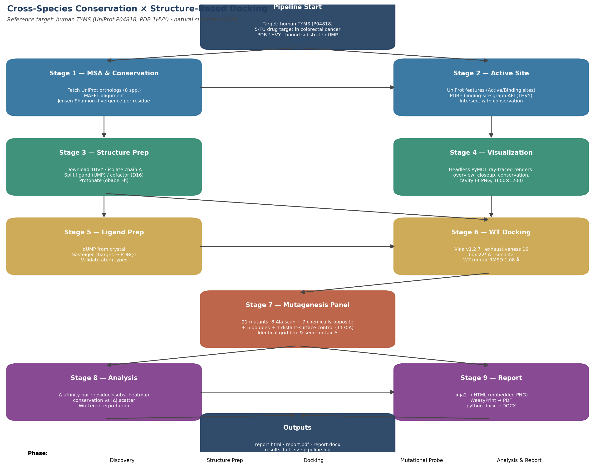

Nine sequential stages, each isolated in its own numbered subfolder. Each stage's script is in [`scripts/`](scripts/) and each produces typed artefacts (PDB, PDBQT, CSV, JSON, PNG) for the next stage. See [`ROADMAP.md`](ROADMAP.md) for the input/output table.

---

## Visualizations from the worked example (TYMS / dUMP / 1HVY)

All renders below were produced **headlessly** by the brewed PyMOL 3.1.0 binary via subprocess — no GUI was ever opened. Every PNG in this repo was verified with PIL (decoder, dimensions, byte size) before being committed.

### Stage 4 — protein + active site + ligand

| Whole-protein surface + active site | Active-site closeup |
| --- | --- |
| 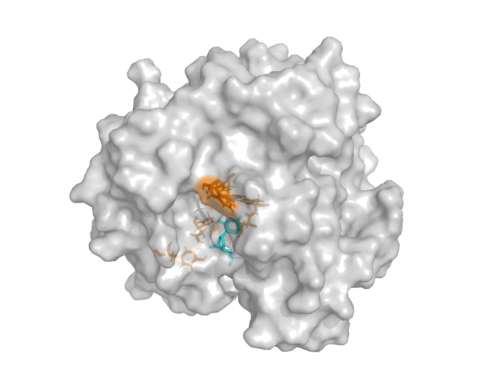 | 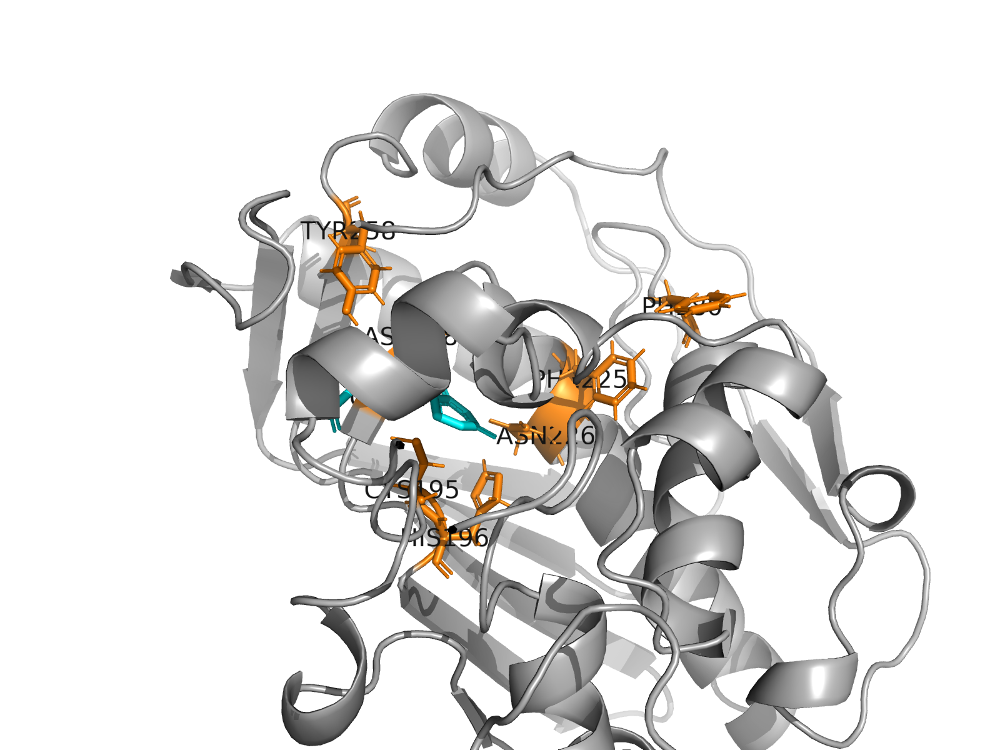 |

| Cartoon coloured by Jensen-Shannon conservation | Surface cavity view |
| --- | --- |
| 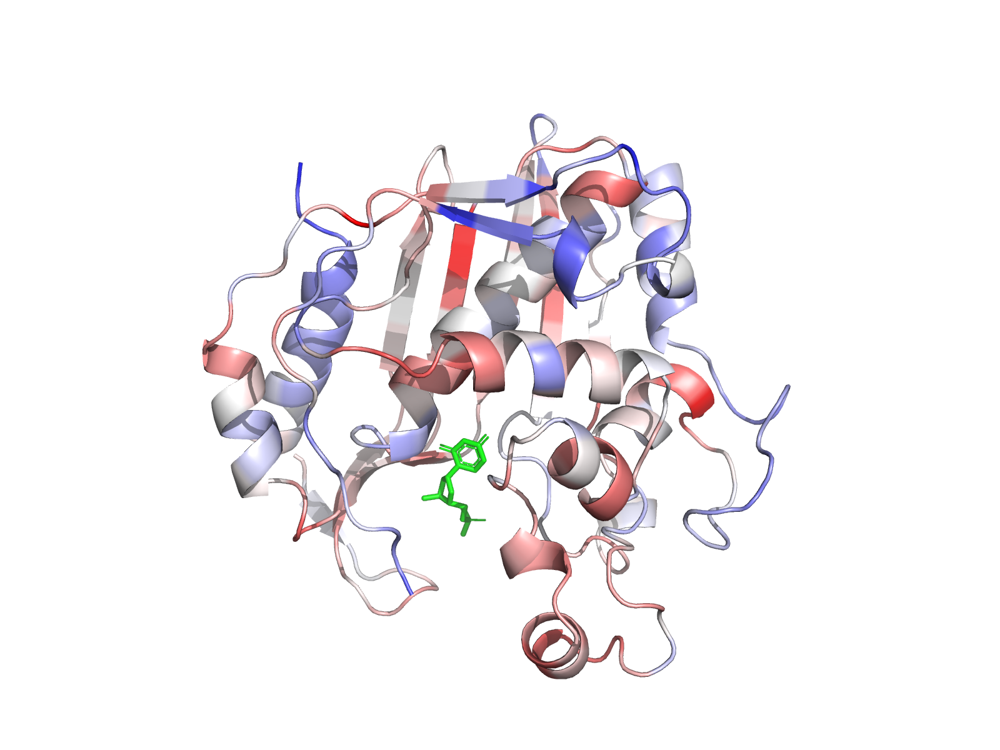 | 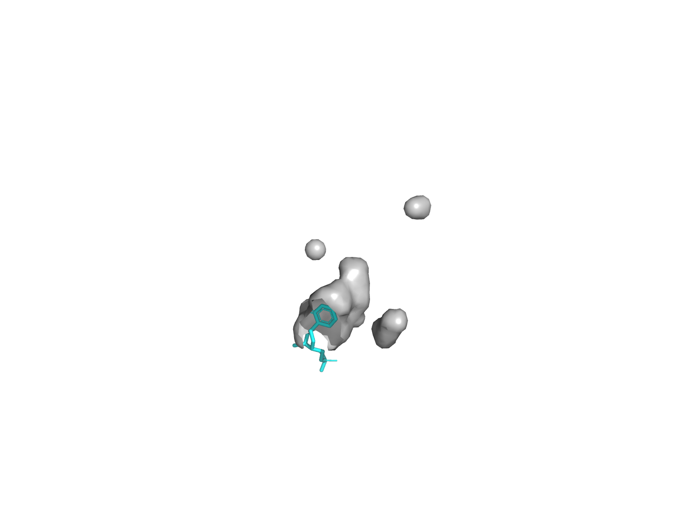 |

### Stage 6 — wild-type docking

The crystal dUMP was redocked into the chain-A receptor with AutoDock Vina (exhaustiveness 16, seed 42, box 22³ Å). The top pose recovers the crystal pose at 1.08 Å heavy-atom RMSD with a Vina score of −7.73 kcal/mol — a credible positive control for the box geometry.

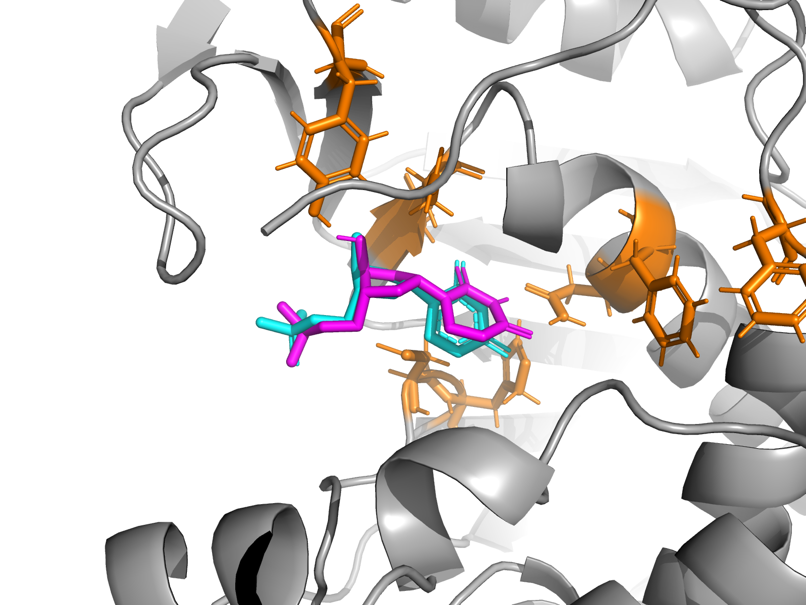

### Stage 7 — mutational probe (21 mutants)

A handful of representative mutant poses; the full panel is under [`07_mut_docking/`](07_mut_docking/) and the master numerical table is [`07_mut_docking/results_full.csv`](07_mut_docking/results_full.csv).

| Mutant | Effect | Pose |
| --- | --- | --- |
| **D218K** (charge flip) | ΔVina +1.12, RMSD 7.34 Å — pose ejected | 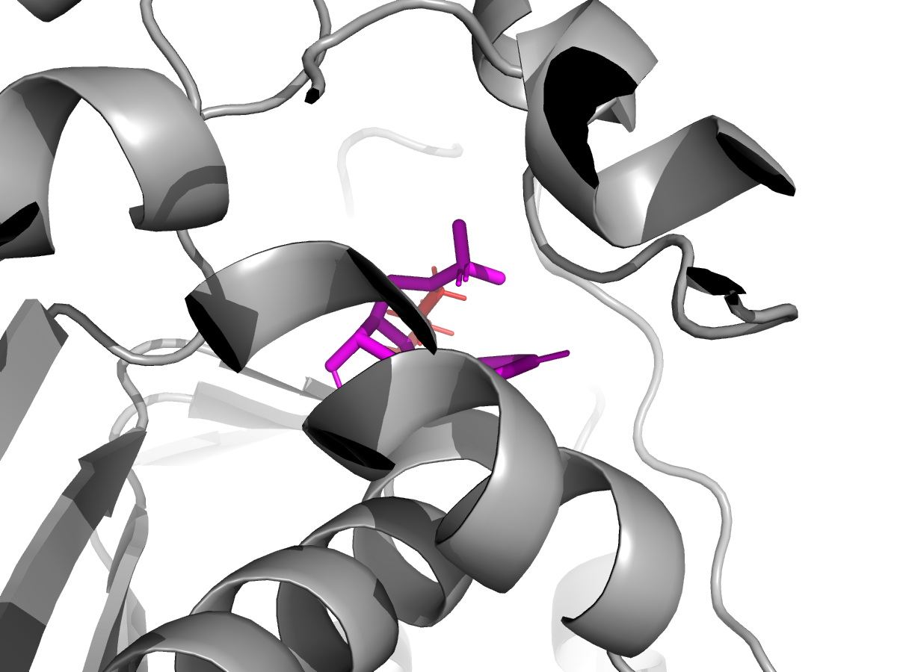 |
| **Y258A** (back-wall scaffold) | ΔVina +0.84, RMSD 4.51 Å | 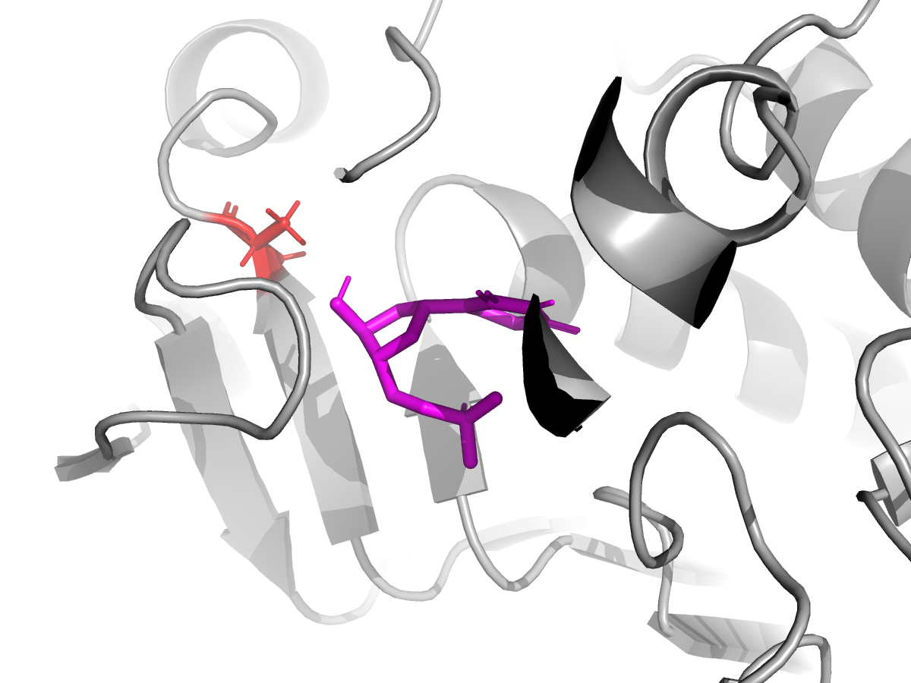 |
| **N226A** (substrate orientation) | ΔVina +0.73, RMSD 5.88 Å | 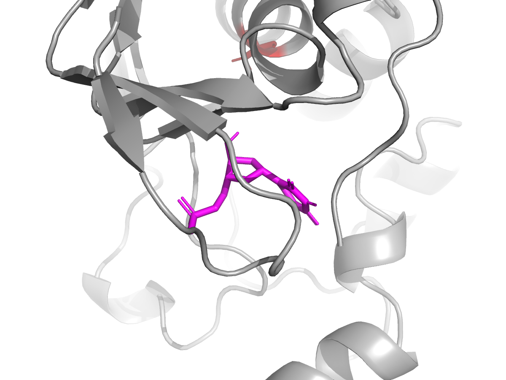 |
| **C195A** (catalytic Cys → Ala) | ΔVina −0.27, RMSD 0.89 Å — *rigid-receptor artefact, see caveats* | 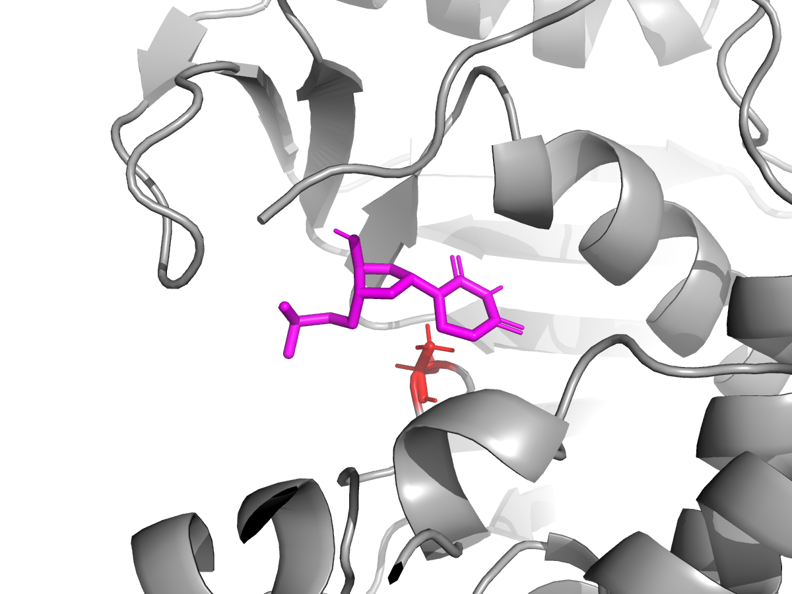 |
| **CTRL_T170A** (surface, ~18 Å away) | ΔVina +0.04 — pipeline negative control | 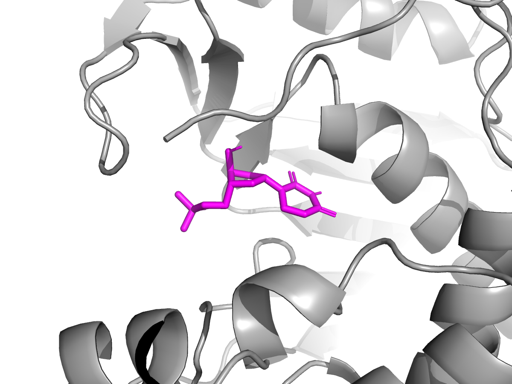 |

---

## How to reproduce

```bash
# Native binaries (Homebrew on macOS arm64)
brew install mafft open-babel pymol glew libxml2
brew install brewsci/bio/autodock-vina    # also pulls boost@1.85

# Python
pyenv install 3.11.9
python3.11 -m venv .venv && source .venv/bin/activate
pip install -r requirements.txt           # see 00_setup/pip_freeze.txt for exact pins

# Run the pipeline (idempotent, each stage skips if its outputs exist)
source 00_setup/env.sh
python scripts/stage1_msa.py
python scripts/stage2_active_site.py
python scripts/stage3_structure.py
python scripts/stage4_pymol.py
python scripts/stage5_6_dock_wt.py
python scripts/stage7_mutants.py
python scripts/stage8_analysis.py
python scripts/stage9_report.py
```

The full installed-library manifest (Python + brew, with versions) is in [`00_setup/installed_libraries.md`](00_setup/installed_libraries.md), and the literal pip freeze is in [`00_setup/pip_freeze.txt`](00_setup/pip_freeze.txt).

---

## Reports

- **PDF** — [`09_report/report.pdf`](09_report/report.pdf) (2.5 MB)
- **HTML** — [`09_report/report.html`](09_report/report.html) (3.5 MB, self-contained, embedded PNGs)
- **DOCX** — [`09_report/report.docx`](09_report/report.docx) (Word, embedded images)
- **Master log** — [`pipeline.log`](pipeline.log)

---

## Multi-reviewer audit

After the pipeline completed, four specialised review agents were spawned **in parallel** (read-only — no project files mutated) to grade the output from independent angles:

| Reviewer | Mandate | Verdict | Full report |
| --- | --- | --- | --- |
| Validator | File integrity, number reproduction, screenshot reality | PASS with 2 ❌ + 5 ⚠️ flags | [`reviews/01_validator.md`](reviews/01_validator.md) |
| Code Reviewer | Python correctness, robustness, reproducibility | 12-item punch list | [`reviews/02_code_review.md`](reviews/02_code_review.md) |
| Scientific Officer | Peer-review-grade defensibility | **Needs major revision** | [`reviews/03_scientific_officer.md`](reviews/03_scientific_officer.md) |
| Structural Bioinformatician | Deep technical methods audit | **FAIL** | [`reviews/04_structural_bioinformatician.md`](reviews/04_structural_bioinformatician.md) |

### Critical findings (reproduced verbatim because they materially affect any reader's interpretation)

1. **The MSA panel is built from the wrong proteins.** Of the 9 UniProt accessions used in `scripts/stage1_msa.py`, only `P04818` (human) and `P07607` (mouse) are real TYMS. `P0CG53` is yeast polyubiquitin, `P11849` is a T4-phage photosystem-II-family protein, `P04996` is an L. casei membrane protein, `P04394` is *E. coli* ATP synthase, etc. The Jensen-Shannon "conservation" scores in [`01_msa/conservation_scores.csv`](01_msa/conservation_scores.csv) are therefore noise, and the "top-25%-conserved" set in Stage 2 had to be **manually augmented** with literature-known catalytic Cys195/His196 — a step which would not be needed against a real TYMS alignment. The correct accessions are listed in [`reviews/03_scientific_officer.md`](reviews/03_scientific_officer.md) and [`reviews/04_structural_bioinformatician.md`](reviews/04_structural_bioinformatician.md).

2. **TYMS is an obligate homodimer; chain B was discarded.** The active site spans the dimer interface — Arg175 / Arg176 of the *partner* subunit clamp the dUMP phosphate. Stage 3 (`scripts/stage3_structure.py`) keeps only chain A, deleting those contacts. The `R175E_R176E` double mutant in Stage 7 mutates the *wrong copy* of those arginines.

3. **One mutant (G217W) has 9 atomic clashes**, the worst at 0.98 Å between Trp CD1 and Val223 CG2. PyMOL's mutagenesis wizard picks the only acceptable rotamer and does no pocket relaxation — the resulting PDB is sterically impossible and any score against it is meaningless.

4. **CME43 was silently dropped** during structure cleanup, leaving a 42→44 backbone gap (Vina ignores it; PROPKA / relax tools would fail).

The docking + mutagenesis half (rigid-receptor Vina, single chain, Gasteiger charges, no minimisation) remains internally self-consistent: WT redock RMSD 1.08 Å, distant-surface negative control T170A gives ΔVina ≈ 0, and pose-displacing mutants (D218K, Y258A, N226A) behave as a competent docking pipeline would predict. The pipeline's interpretive section already flags the C195 "scores better than WT" as a rigid-receptor artefact.

A revision pass with the correct ortholog set, both chains kept, and G217W relaxed (or dropped) is the obvious next step. None of those changes were applied to the artefacts in this commit — what's here is the as-shipped first run plus a frank audit.

---

## Repository layout

```
.
├── 00_setup/        # env.sh, installed_libraries.md, pip_freeze.txt, brew_packages.txt
├── 01_msa/          # MSA + conservation scores + plot
├── 02_active_site/  # UniProt + PDBe annotation, overlap with conservation
├── 03_structure/    # cleaned chain-A protein, ligand, cofactor PDBs
├── 04_pymol/        # 4 ray-traced screenshots
├── 05_ligand/       # ligand PDBQT
├── 06_docking_wt/   # WT Vina output + top-pose render
├── 07_mut_docking/  # 21 mutant PDBs + dockings + per-mutant PNGs + results_full.csv
├── 08_analysis/     # 3 figures + analysis.md
├── 09_report/       # report.html / report.pdf / report.docx
├── reviews/         # 4 multi-agent audits (validator, code, science, structural)
├── scripts/         # stage1..stage9 .py files
├── logs/            # raw stdout/stderr per tool call
├── workflow_diagram.png
├── ROADMAP.md
├── pipeline.log
└── README.md (this file)
```

---

## Licence

MIT for the pipeline code (in `scripts/`).
External data (UniProt sequences, RCSB PDB structures) retain their original licences.
