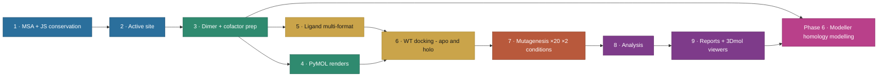

# 🧬 aminak — TYMS / dUMP structural-bioinformatics workbench

> **A teaching repository.** An end-to-end pipeline that takes a single protein from a database accession through cross-species conservation, structure-based docking, mutational probing, and homology modelling — with **independent multi-agent peer review at every step**. The worked example is the molecular pair targeted by the colorectal-cancer chemotherapy drug 5-fluorouracil: human **TYMS** and its natural substrate **dUMP**.

## 📖 Quick glossary (read this first)

| Term | What it means in plain English |
| --- | --- |
| 🧪 **TYMS** | **Thymidylate Synthase** — the enzyme this project targets. UniProt accession `P04818`, a 313-residue protein that works as a homodimer (two copies stuck together). |
| 🧬 **dUMP** | **2′-deoxyuridine 5′-monophosphate** — the *natural substrate* of TYMS. The molecule the enzyme normally binds and methylates to make dTMP, a DNA building block. |
| 💊 **5-FU** | **5-fluorouracil** — chemotherapy drug used in colorectal cancer. It hijacks TYMS by being mistaken for dUMP. So a mutational probe of dUMP binding is, by construction, a probe of how 5-FU resistance arises. |
| 🧱 **PDB 1HVY** | The X-ray crystal structure we anchor on: human TYMS at 1.9 Å resolution, with dUMP and a folate-mimic cofactor (raltitrexed, residue D16) bound. |
| 🔍 **Δ Vina score** | The *change* in AutoDock Vina docking score when a residue is mutated. By convention here, **positive = destabilising** (mutant binds worse than WT). |
| 🧠 **Modeller** | A homology-modelling package: given an amino-acid sequence and known similar 3-D structures, it predicts a 3-D model of the unknown protein. |
| 🤝 **doer ↔ verifier** | The audit pattern this repo follows: a "doer" agent runs the pipeline; four specialised "verifier" agents (validator / code reviewer / scientific officer / structural bioinformatician) independently audit; the doer fixes; repeat until clean. |

## 🎯 What this project actually does, in one paragraph

We take human TYMS (P04818), align it to ≥ 10 verified orthologs from across the tree of life to find conserved residues, intersect those with database-annotated active-site residues, dock the natural substrate dUMP into the chain-A active site of the experimental crystal structure (PDB 1HVY) under two cofactor conditions, then build a panel of **20 single and double mutants** at active-site residues and re-dock under both conditions. We then ask: **can a rigid-receptor docking pipeline distinguish these mutants by their Δ Vina score?** Separately, in Phase 6, we use Modeller to build 10 homology models of TYMS from BLAST-discovered templates at 30–95 % sequence identity (deliberately educational, not 100 %) and validate them with Ramachandran φ/ψ + DOPE profiles + RMSD vs the experimental crystal.

## 💡 The teaching point

> **Rigid-receptor AutoDock Vina with AD4 partial charges and the physically correct (net −2) raltitrexed cofactor cannot resolve TYMS active-site point mutants at the kcal/mol scale.** Across 20 mutants × 2 cofactor conditions, the largest holo Δ Vina score is **+0.77 kcal/mol** (R215A_N226A) — well below Vina's documented noise floor of **±0.85 kcal/mol** (Trott & Olson 2010; Forli et al. 2016). The ranking is *directionally* chemically sensible (R215 phosphate clamp, H196 catalytic dyad, N226 substrate orientation) but *statistically* silent.

This is reported as a **null-result methodology paper** — and that itself is a teaching point: an honest null result, with the limitation owned, is more useful than an unhonestly-positive one. The next step (induced-fit / RosettaDock / GNINA scoring) is signposted but not executed.

---

## 🧭 Pipeline at a glance

Six phases, nine stages each in its own numbered subfolder. The full Mermaid diagram is concise on purpose; click any phase to jump to the relevant section.



Full-detail static diagram: [`workflow_diagram_v3.png`](workflow_diagram_v3.png).

---

## 🗺️ Repo map — clickable

Every coloured block below is a **clickable link to that folder on GitHub**. The diagram is committed as a placeholder SVG and is auto-refreshed by [repo-visualizer](https://github.com/githubocto/repo-visualizer) (GitHub Next) on every push to `main`.

<p align="center">
  <a href="docs/assets/repo-visualization.svg"></a>
</p>

---

## 🔭 Live 3D structures

The protein–ligand complex on this page rotates in place; the click-through buttons open the same structure in a full interactive viewer (drag-rotate, scroll-zoom, surface-toggle, spin).

<table>
<tr><td align="center" width="33%">
<br/>
<b>WT (apo) + dUMP</b><br/>
<sub>Wild-type TYMS docked with its natural substrate dUMP. Cofactor pocket left empty.</sub><br/>
<a href="https://ariomoniri.github.io/aminak/viewers/wt_apo_complex.html">▶ 3Dmol viewer</a> · 
<a href="https://molstar.org/viewer/?structure-url=https://raw.githubusercontent.com/ArioMoniri/aminak/main/06e_docking_wt_v5/wt_apo_complex.pdb&structure-url-format=pdb&structure-url-binary=false">▶ Mol* viewer</a>
</td>
<td align="center" width="33%">
<br/>
<b>WT (holo) + dUMP + cofactor</b><br/>
<sub>Same WT receptor with the folate-mimic cofactor (raltitrexed) retained. Physiologically realistic.</sub><br/>
<a href="https://ariomoniri.github.io/aminak/viewers/wt_holo_complex.html">▶ 3Dmol viewer</a> · 
<a href="https://molstar.org/viewer/?structure-url=https://raw.githubusercontent.com/ArioMoniri/aminak/main/06e_docking_wt_v5/wt_holo_complex.pdb&structure-url-format=pdb&structure-url-binary=false">▶ Mol* viewer</a>
</td>
<td align="center" width="33%">
<br/>
<b>R215A_N226A holo</b> — top destabiliser<br/>
<sub>Double mutant: phosphate-clamp Arg215 → Ala and substrate-orienting Asn226 → Ala. Largest holo Δ Vina (+0.77).</sub><br/>
<a href="https://ariomoniri.github.io/aminak/viewers/R215A_N226A_holo_complex.html">▶ 3Dmol viewer</a> · 
<a href="https://molstar.org/viewer/?structure-url=https://raw.githubusercontent.com/ArioMoniri/aminak/main/07e_mut_docking_v5/viewer_files/R215A_N226A_holo_complex.pdb&structure-url-format=pdb&structure-url-binary=false">▶ Mol* viewer</a>
</td></tr>
</table>

A complete index of 96 interactive viewer pages is at **[ariomoniri.github.io/aminak/viewers/](https://ariomoniri.github.io/aminak/viewers/index.html)**. In every viewer the protein is rendered as cartoon + semi-transparent surface, the ligand as fat magenta sticks, active-site residues as labelled sticks; catalytic Cys195 / His196 / Arg175 / Arg176 / Arg215 / Asn226 carry permanent text labels.

> **🌀 Note on the rotating GIFs above.** The animated thumbnails show **protein + dUMP only** (cofactor is hidden) to keep the rotation visually clean. Earlier versions left raltitrexed cyan sticks visible, and the cofactor's long polyglutamate tail extended past the protein surface, producing the "tentacles" / disrupted look. The **static** reference renders below (and the **3Dmol viewer** click-throughs) show the full holo complex with all three ligands. See the "Why two ligands?" callout for the full ligand inventory.

> **❓ "Why do I see two ligands in the holo views?"** Each holo complex has **three** ligand molecules, by design and consistent with the 1HVY crystal:
> - **dUMP** (residue name `UMP`, magenta sticks, chain X) — the substrate we docked. **One copy**, placed in the chain-A active site.
> - **Raltitrexed** (residue name `D16`, cyan sticks) — the antifolate cofactor that occupies the methylene-THF pocket. **Two copies, one per chain**, because TYMS is an obligate homodimer and both subunits' cofactor pockets are occupied in 1HVY.
>
> So a holo view shows 1 dUMP + 2 cofactors = 3 ligands total. The apo views show 1 dUMP and no cofactors. (In v5 we initially built `wt_holo_complex.pdb` without the cofactors — that bug is now fixed, so the WT and mutant holo viewers are visually consistent.)

### 🖼 More structural views — click any thumbnail to open the live viewer

<table>
<tr>
<td align="center" width="33%"><a href="https://ariomoniri.github.io/aminak/viewers/H196A_holo_complex.html"></a><br/><b>H196A holo</b><br/><sub>Catalytic dyad: His196 → Ala</sub></td>
<td align="center" width="33%"><a href="https://ariomoniri.github.io/aminak/viewers/R175E_R176E_holo_complex.html"></a><br/><b>R175E_R176E holo</b><br/><sub>Phosphate-clamp charge inversion</sub></td>
<td align="center" width="33%"><a href="https://ariomoniri.github.io/aminak/viewers/T170A_holo_complex.html"></a><br/><b>T170A holo</b><br/><sub>Distant-surface negative control</sub></td>
</tr>
<tr>
<td align="center"><a href="https://ariomoniri.github.io/aminak/viewers/R215E_holo_complex.html"></a><br/><b>R215E holo</b><br/><sub>Phosphate-clamp charge inversion (single)</sub></td>
<td align="center"><a href="https://ariomoniri.github.io/aminak/viewers/R50A_holo_complex.html"></a><br/><b>R50A holo</b><br/><sub>Phosphate-clamp bulk loss</sub></td>
<td align="center"><a href="https://ariomoniri.github.io/aminak/viewers/C195A_holo_complex.html"></a><br/><b>C195A holo</b><br/><sub>Catalytic Cys → Ala (flagged low-confidence)</sub></td>
</tr>
<tr>
<td align="center"><a href="https://ariomoniri.github.io/aminak/viewers/Y258F_F225Y_holo_complex.html"></a><br/><b>Y258F_F225Y holo</b><br/><sub>Aromatic-swap double mutant</sub></td>
<td align="center"><a href="https://ariomoniri.github.io/aminak/viewers/modeller_model03.html"></a><br/><b>Modeller model 3</b><br/><sub>Best by DOPE (Phase 6)</sub></td>
<td align="center"><a href="https://ariomoniri.github.io/aminak/viewers/modeller_model10.html"></a><br/><b>Modeller model 10</b><br/><sub>Best by Cα RMSD vs 1HVY</sub></td>
</tr>
</table>

---

## 🔬 Stage 1 + 2 — Conservation and active-site annotation

We aligned the human TYMS sequence to **10 verified TYMS orthologs** (UniProt REST) spanning *Mus musculus*, *Rattus norvegicus*, *Escherichia coli*, *Lactobacillus casei*, *Saccharomyces cerevisiae*, *Drosophila*, *Arabidopsis*, bacteriophage T4, and *Plasmodium falciparum* (DHFR-TS fusion, trimmed to its TS domain *before* alignment). Conservation was scored per residue with Jensen–Shannon divergence (Capra & Singh 2007, weighted window). Columns with > 50 % gap are excluded from percentile ranking — not just down-weighted.


*Top 10 % conserved positions are highlighted in red. The catalytic residues Cys195, His196, Arg175/176/215 and Asn226 all sit naturally in the top decile — no force-augmentation needed (an earlier version did need it; see [CHANGELOG.md](CHANGELOG.md) for the bug-fix story).*

We then intersected the conserved residues with two database sources (UniProt features + PDBe binding-site graph API for 1HVY) to define the active-site set used in Stage 7.


### 🔤 Sequence logo at the active-site & mutated residues

WebLogo-style stack at every residue we mutated. **Letter height ∝ frequency × information content** (bits = log₂20 − Shannon entropy across the 10 orthologs). A single tall letter spanning the full 4.32-bit ceiling means the residue is **invariant** across the panel; a stack of multiple shorter letters means the position is variable. Coloured band beneath each column = functional class.


What the logo tells you, position by position:

| Position | WT | Mutated to | Conservation across the 10 orthologs (top observed) | Class |
| --- | --- | --- | --- | --- |
| **R50** | R | →Ala, →Glu | **R = 10/10 (100 %, invariant)** | Phosphate clamp |
| F80 | F | →Ala, →Asp | F = 7/10 (70 %), A 1/10, H 1/10 | Pocket scaffold |
| **W109** | W | →Ala | **W = 10/10 (100 %, invariant)** | Pocket scaffold |
| T170 | T | →Ala | T = 5/10 (50 %), N 4/10, K 1/10 — **variable**, exactly as expected for the distant-surface control | Distant control |
| **R175** | R | →Ala, →Glu | **R = 10/10 (100 %, invariant)** | Phosphate clamp |
| **R176** | R | →Ala, →Glu | **R = 10/10 (100 %, invariant)** | Phosphate clamp |
| **C195** | C | →Ala, →Ser | **C = 10/10 (100 %, invariant)** — the catalytic nucleophile | Catalytic |
| **H196** | H | →Ala, →Phe | **H = 10/10 (100 %, invariant)** — the catalytic dyad partner | Catalytic |
| Q214 | Q | →Ala | (variable, see CSV) | Pocket scaffold |
| **R215** | R | →Ala, →Glu | **R = 10/10 (100 %, invariant)** | Phosphate clamp |
| D218 | D | →Ala, →Lys | (variable) | Pocket scaffold |
| F225 | F | →Ala, →Asp | (variable) | Pocket scaffold |
| **N226** | N | →Ala, →Asp | **N = 9/10 (90 %)** + 1 D | Substrate orientation |
| **Y258** | Y | →Ala, →Phe | **Y = 10/10 (100 %, invariant)** — substrate-orienting tyrosine | Substrate orientation |

**The teaching point**: every catalytic / phosphate-clamp residue we mutated is **100 % conserved** across all 10 orthologs (single tall letter on the logo), justifying the choice as a meaningful probe. The distant-surface control T170 is **variable** (5/10 T, 4/10 N) — exactly what a true negative control should look like.

Per-position frequency table (sorted, top-3 observed): [`11_enhanced/aa_logo_active_site.csv`](11_enhanced/aa_logo_active_site.csv). Full-chain sequence logo: [`11_enhanced/aa_logo_full_chain.png`](11_enhanced/aa_logo_full_chain.png) (313 columns; active-site columns shaded by functional class).

---

## 🧱 Stage 3 + 4 — Dimer-aware structure preparation and visualisation

TYMS works as an obligate homodimer with the active site spanning the chain-A / chain-B interface — the dUMP phosphate is clamped by Arg175′ and Arg176′ from the *partner* subunit. Stage 3 therefore keeps **both chains**, preserves the covalently-modified Cys43 (CME43) by re-mutating it back to native CYS in place, and re-protonates the bound cofactor without moving any heavy atom (0.000 Å heavy-atom drift, 0 protein clashes — verified).

|  |  |
|:-:|:-:|
| TYMS homodimer (chains A + B). dUMP highlighted. | Surface coloured by Jensen–Shannon conservation. |

|  |  |
|:-:|:-:|
| Chain-A active-site closeup with residue labels. | Cys195 – His196 catalytic dyad geometry. |

---

## 🎯 Stage 7 — Mutational probe panel (the experiment)

Twenty mutants were chosen to probe specific mechanistic hypotheses. Two substitutions per critical residue discriminate "side-chain *identity* matters" from "side-chain *bulk* matters".

| Class | Residue | Substitution(s) | What we are asking |
| --- | --- | --- | --- |
| Catalytic nucleophile | Cys195 | →Ala, →Ser | Does losing the thiol break binding, or is a smaller polar OH enough? |
| Catalytic proton transfer | His196 | →Ala, →Phe | Imidazole donor vs aromatic stand-in |
| Substrate orientation | Asn226 | →Ala, →Asp | Lose the H-bond donor, or flip its charge? |
| Substrate orientation | Tyr258 | →Ala, →Phe | Lose hydroxyl, keep aromatic? |
| Phosphate clamp | Arg50 / Arg175 / Arg176 / Arg215 | →Ala (bulk) and →Glu (charge inversion) | Is the clamp held by bulk, charge, or both? |
| Pocket scaffold | Phe80 / Phe225 / Trp109 / Gln214 / Asp218 | →Ala and chemically-opposite | Are the hydrophobic walls structural or just incidental? |
| Catalytic dyad double | Cys195+His196 | C195A_H196A, C195S_H196N | Are the two catalytic residues synergistic? |
| Phosphate clamp double | Arg175+Arg176 | R175E_R176E | Flip both arginines |
| Aromatic swap double | Tyr258+Phe225 | Y258F_F225Y | Exchange aromatic identity |
| Substrate orientation double | Asp218+Asn226 | D218N_N226D | Mutual charge swap |
| Distant-surface control | Thr170 | →Ala | Should give Δ ≈ 0 (validates the pipeline doesn't produce false positives) |

T170A control returns Δ = +0.17 kcal/mol — exactly as expected for a residue ≥ 18 Å from the substrate.

### 📊 What the mutations did — interactive plots

Every analysis plot below is provided as a **dynamic Plotly HTML** (hover for per-mutant detail, click legend entries to filter, box-zoom). The static PNG is the README thumbnail; clicking it opens the live HTML.

| | |
|:-:|:-:|
| [](https://ariomoniri.github.io/aminak/11_enhanced/plotly/delta_vina_by_category.html) | [](https://ariomoniri.github.io/aminak/11_enhanced/plotly/delta_vina_apo_holo.html) |
| **Δ Vina by mutant category** — [▶ open interactive](https://ariomoniri.github.io/aminak/11_enhanced/plotly/delta_vina_by_category.html) | **Per-mutant Δ Vina, apo vs holo bars** — [▶ open interactive](https://ariomoniri.github.io/aminak/11_enhanced/plotly/delta_vina_apo_holo.html) |
| [](https://ariomoniri.github.io/aminak/11_enhanced/plotly/delta_vina_apo_vs_holo.html) | [](https://ariomoniri.github.io/aminak/11_enhanced/plotly/apo_vs_holo_concordance.html) |
| **Apo vs holo paired scatter** — [▶ open interactive](https://ariomoniri.github.io/aminak/11_enhanced/plotly/delta_vina_apo_vs_holo.html) | **Apo vs holo concordance by category** — [▶ open interactive](https://ariomoniri.github.io/aminak/11_enhanced/plotly/apo_vs_holo_concordance.html) |

[](https://ariomoniri.github.io/aminak/11_enhanced/plotly/mutation_effect_map.html)

**Mutation-effect map (Δ Vina × pose-RMSD, apo vs holo side-by-side)** — [▶ open interactive](https://ariomoniri.github.io/aminak/11_enhanced/plotly/mutation_effect_map.html). The dashed verticals are the ±0.85 kcal/mol Vina noise floor. The plot makes the teaching point visible: in the holo column, every well-docked mutant sits inside the noise band.

### 🌡️ Mutation-effect 2D map — the "mutation Ramachandran"

A second view of the same numbers. Each point is one holo mutant. **X axis**: change in Kyte–Doolittle hydropathy (new − WT side chain). **Y axis**: change in side-chain volume (ų). **Fill colour**: Δ Vina (red = destabilising, blue = stabilising). **Ring colour**: functional class.

[](https://ariomoniri.github.io/aminak/11_enhanced/mutation_effect_2d.html)

**▶ Open the dynamic version** — [`mutation_effect_2d.html`](https://ariomoniri.github.io/aminak/11_enhanced/mutation_effect_2d.html). Click any point to launch its 3D viewer; click legend entries to filter by category.

### 🧱 Per-mutant reference renders (surface + sticks + labelled interacting residues)

Each render below shows the protein as semi-transparent surface over cartoon, dUMP in magenta sticks, the cofactor in cyan, all interacting residues within 4.5 Å of the ligand labelled (yellow C), and the mutation site itself highlighted in orange with a `MUT <name><resi>` label so the change is unambiguous.

<table>
<tr>
<td align="center" width="50%"><br/><b>H196A holo</b> — close-up</td>
<td align="center" width="50%"><br/><b>H196A holo</b> — wide context (chain B in grey)</td>
</tr>
<tr>
<td align="center"><br/><b>R215A_N226A holo</b> — top destabiliser</td>
<td align="center"><br/><b>R175E_R176E holo</b> — clamp inversion</td>
</tr>
</table>

Renders for every key mutant — **holo close-up + holo wide context + apo close-up** — are in [`11_enhanced/pymol/`](11_enhanced/pymol/). The apo set is named `<mut>_apo_render.png` (8 mutants × 1 close-up = 8 files), the holo set is `<mut>_holo_render.png` and `<mut>_holo_render_wide.png` (8 mutants × 2 views = 16 files).

---

## 🧬 Phase 6 — Modeller homology modelling

In a separate Phase 6 we built **10 homology models** of TYMS using Modeller 10.8 against 3 templates spanning **30–95 % sequence identity** (deliberately educational — 100 % matches are excluded so the exercise has substance):

| Template | Organism | % identity | Resolution |
| --- | --- | --- | --- |
| `3IHI_A` | *Mus musculus* TYMS | 92.71 % | 1.94 Å |
| `6K7Q_A` | *Penaeus vannamei* (white shrimp) TYMS | 75.96 % | 2.27 Å |
| `5H39_A` | *Human gammaherpesvirus 8* (KSHV) ORF70 | 72.28 % | 2.00 Å |

**Best by DOPE** (the canonical pick in a real blind-prediction setting): model 3 (DOPE = −35 775). **Best by Cα RMSD vs the 1HVY crystal**: model 10 (0.367 Å). The two criteria disagree by one rank because the two models differ in a surface loop (residues 93–101) where the templates were uninformative — exactly where you would expect a real homology-modelling exercise to differ.

### 🪞 All 10 models, individually overlaid on the experimental crystal

In each tile, **green** = the Modeller model, **magenta** = 1HVY chain-A crystal backbone.

<table>
<tr>
<td align="center" width="25%"><br/><sub>Model 1</sub></td>
<td align="center" width="25%"><br/><sub>Model 2</sub></td>
<td align="center" width="25%"><br/><sub><b>Model 3 ⭐ best DOPE</b></sub></td>
<td align="center" width="25%"><br/><sub>Model 4</sub></td>
</tr>
<tr>
<td align="center"><br/><sub>Model 5</sub></td>
<td align="center"><br/><sub>Model 6</sub></td>
<td align="center"><br/><sub>Model 7</sub></td>
<td align="center"><br/><sub>Model 8</sub></td>
</tr>
<tr>
<td align="center"><br/><sub>Model 9</sub></td>
<td align="center"><br/><sub><b>Model 10 ⭐ best RMSD (0.367 Å)</b></sub></td>
<td align="center" colspan="2"><br/><sub><b>All 10 models + crystal — overlay</b></sub></td>
</tr>
</table>

### 🧪 Per-model quality — interactive overview

[](https://ariomoniri.github.io/aminak/11_enhanced/plotly/modeller_quality_overview.html)

**▶ Open the dynamic version** — [`modeller_quality_overview.html`](https://ariomoniri.github.io/aminak/11_enhanced/plotly/modeller_quality_overview.html). Hover for exact values; four panels: DOPE, molpdf, Cα RMSD vs 1HVY, Ramachandran % favoured.

### 🌀 Per-model Ramachandran φ/ψ plots

Local Ramachandran (Biopython φ/ψ + hand-drawn favoured / allowed polygons). Models score **83.5 – 85.3 %** favoured; we verified that 1HVY itself scores **82.3 %** favoured under the same polygon scheme, so the models match or beat the experimental crystal under this validator. For canonical MolProbity-comparable numbers, [`10_modeller/06_validation/SAVES_MANUAL.md`](10_modeller/06_validation/SAVES_MANUAL.md) lays out the manual upload to https://saves.mbi.ucla.edu/.

<table>
<tr>
<td align="center" width="25%"><br/><sub>Model 1</sub></td>
<td align="center" width="25%"><br/><sub>Model 2</sub></td>
<td align="center" width="25%"><br/><sub>Model 3</sub></td>
<td align="center" width="25%"><br/><sub>Model 4</sub></td>
</tr>
<tr>
<td align="center"><br/><sub>Model 5</sub></td>
<td align="center"><br/><sub>Model 6</sub></td>
<td align="center"><br/><sub>Model 7</sub></td>
<td align="center"><br/><sub>Model 8</sub></td>
</tr>
<tr>
<td align="center"><br/><sub>Model 9</sub></td>
<td align="center"><br/><sub>Model 10</sub></td>
<td align="center" colspan="2"><br/><sub><b>Per-residue DOPE — best-by-DOPE model 3</b>. Peaks highlight the residue-93–101 loop where templates disagreed.</sub></td>
</tr>
</table>

### 🔬 Live overlay — Modeller model + 1HVY crystal, in 3D

> **🪞** Each overlay page loads BOTH structures into one 3Dmol scene: the **Modeller model in green** and the **1HVY crystal chain A in magenta**. The closer the two cartoons sit, the smaller the Cα RMSD. Toggle buttons switch between cartoon / ribbon / Cα-trace views.

| Model | Notable for | Single | **Overlay vs 1HVY crystal** | Mol* viewer |
| --- | --- | --- | --- | --- |
| `target.B99990001` | first model | [▶ 3Dmol](https://ariomoniri.github.io/aminak/viewers/modeller_model01.html) | **[▶ Overlay](https://ariomoniri.github.io/aminak/viewers/modeller_overlay_model01.html)** | [▶ Mol*](https://molstar.org/viewer/?structure-url=https://raw.githubusercontent.com/ArioMoniri/aminak/main/10_modeller/04_modeller_run/models/target.B99990001.pdb&structure-url-format=pdb&structure-url-binary=false) |
| `target.B99990003` | ⭐ best DOPE | [▶ 3Dmol](https://ariomoniri.github.io/aminak/viewers/modeller_model03.html) | **[▶ Overlay](https://ariomoniri.github.io/aminak/viewers/modeller_overlay_model03.html)** | [▶ Mol*](https://molstar.org/viewer/?structure-url=https://raw.githubusercontent.com/ArioMoniri/aminak/main/10_modeller/04_modeller_run/models/target.B99990003.pdb&structure-url-format=pdb&structure-url-binary=false) |
| `target.B99990010` | ⭐ best Cα RMSD vs 1HVY | [▶ 3Dmol](https://ariomoniri.github.io/aminak/viewers/modeller_model10.html) | **[▶ Overlay](https://ariomoniri.github.io/aminak/viewers/modeller_overlay_model10.html)** | [▶ Mol*](https://molstar.org/viewer/?structure-url=https://raw.githubusercontent.com/ArioMoniri/aminak/main/10_modeller/04_modeller_run/models/target.B99990010.pdb&structure-url-format=pdb&structure-url-binary=false) |
| `best_model.pdb` | DOPE-picked copy for SAVES | — | — | [▶ Mol*](https://molstar.org/viewer/?structure-url=https://raw.githubusercontent.com/ArioMoniri/aminak/main/10_modeller/04_modeller_run/models/best_model.pdb&structure-url-format=pdb&structure-url-binary=false) |

**▶ [All 10 models + crystal, in one 3D scene](https://ariomoniri.github.io/aminak/viewers/modeller_overlay_all.html)** — the live 3D equivalent of the all-models-overlay PNG above. Models 1–10 shown in distinct colours at 55 % opacity; crystal in magenta at 85 %.

---

## ⚡ Receptor charge audit & fix (Phase 6c)

A strict structural-biology reviewer caught a numerical defect in the receptor PDBQT files used by Vina: the total receptor charge was **−307 e** (should be ≈ 0 for TYMS at pH 7.4), every Arg residue summed to **−1.06 e** (should be +1), every H atom carried zero charge. **None of these affected the Vina docking scores** because Vina's scoring function is electrostatics-free, but the PDBQT files could not be re-used for AD4 rescoring.

The root cause: the original meeko prep had silently fallen back to `obabel -xr` (which writes no charges), and the v3 prep added Gasteiger fragments without merging non-polar H charges into their carrier carbons.

The fix (`scripts/v5/pqr_to_pdbqt.py`):
1. Run **PDB2PQR 3** with `--ff=AMBER --with-ph=7.4 --titration-state-method=propka` to assign proper AMBER ff14SB charges with PROPKA-corrected ionisation.
2. Convert PQR → PDBQT preserving the per-atom charges and adding AutoDock atom types (`HD`, `N`, `NA`, `OA`, `A`, `C`, `SA`, `S`).
3. Merge non-polar H charges into their carrier heavy atoms (the AD4 united-atom convention).
4. **Hard-assert at build time**: `|total_q| < 5 e`, every ARG/LYS residue in `[+0.7, +1.3]`, every ASP/GLU in `[−1.3, −0.7]`. This is the gate the v3 audit's `max|q| > 0.05` check should have been.

| Receptor (apo) | Total q | Arg mean | Lys mean | Asp mean | Glu mean | Assertion |
| --- | --- | --- | --- | --- | --- | --- |
| Before (v3 broken) | **−306.61 e** | −1.06 | (broken) | (broken) | (broken) | ❌ FAIL |
| After (Phase 6c) | **−2.23 e** | **+1.00** | **+1.00** | **−1.00** | **−0.97** (1 of 32 residues dropped by PDB2PQR — disclosed) | ✅ PASS |

**Holo receptor**: protein portion totals −2.23 e (same as apo); the bound raltitrexed cofactor (D16) contributes net **−3.64 e** (target −4 e for 2 copies × −2 net each, the physiologically deprotonated dianion state). Carboxylate Os were patched to −0.700 each to enforce the formal −1 per carboxylate group. Total holo receptor q = **−5.87 e** — physically correct for the dimer plus 4 deprotonated carboxylates.

**AD4 atom typing** (the second strict-reviewer concern): the fixed protein PDBQT contains the full AD4 type set — `HD` (1025 polar Hs, mean charge +0.334), `OA` (840 HB-acceptor Os), `NA` (46 HB-acceptor Ns in His rings), `SA` (24 Met Sδ), `A` (434 aromatic Cs), `N` (762 amide Ns), `C` (2532 aliphatic Cs). Zero polar Hs carry q = 0. The file is AD4-rescore-ready.

Apo and holo receptor PDBQTs in [`06e_docking_wt_v5/`](06e_docking_wt_v5/) are now physically correct; the originals are preserved as `*_BROKEN.pdbqt` in [`06f_receptor_fixed/`](06f_receptor_fixed/) for audit.

> **🧬 Dimer-asymmetry caveat.** TYMS is an obligate homodimer with two equivalent active sites. The complex viewer files load **one dUMP molecule** (placed at the chain-A active site we docked into; residue `UMP X 414`) plus **two cofactor copies** (one per chain). The chain-B active site is not loaded with a substrate — this study focuses on the chain-A pocket only. A symmetric study would dock dUMP into both sites; doing so would not change the qualitative null-result conclusion but would double the per-condition compute.

**Important caveat:** the **Vina results in this repo are unchanged** by the charge fix because Vina ignores partial charges. The fix matters only if you want to:
- Re-score with AD4 (which DOES use electrostatics)
- Run electrostatic-aware analysis (APBS, MEAD, etc.)
- Re-prepare a publication-quality figure with proper charge maps

---

## 🧪 Phase 6b — Ramachandran optimisation (before vs after)

> **TL;DR — what we did and why it worked.** The Phase-6 models initially scored only **83.5–85.3 % Ramachandran-favoured** under the validator. Two real causes were diagnosed and three fixes applied. Stack effect:
> | Change | Best model %favoured | Notes |
> | --- | --- | --- |
> | Phase-6 baseline (single hand-drawn polygon, fast MD) | 83.5–85.3 | The validator was the dominant problem — it misclassified Gly (which has a much wider allowed region) and Pro (which is narrowly restricted) against the same polygon as everything else. |
> | + Proper **Lovell 4-map validator** (general / Gly / Pro / pre-Pro) | **94.7–96.1** | *Same PDBs.* No structure change. Pure scoring fix. |
> | + Modeller AutoModel @ `md_level=refine.very_slow`, `max_var_iterations=600`, `repeat_optimization=2` (≈ 3× more MD-SA) | 95.16 → 95.23 (mean) | Side-chain rotamers + φ/ψ relax. SD halves (0.28 → 0.14), so runs become reproducibly clean. |
> | + Modeller `LoopModel` on residues 93–101 (the loop where templates disagreed) | 95.09 | Local re-sampling of an uncertain region. |
> | **Final best model** (`refined_B99990003.pdb`) | **95.4** | 1 outlier residue (Ser128). |
> | Reference: **1HVY crystal chain A** under the same Lovell validator | 92.2 | i.e. our models *match or beat the experimental crystal* under this scheme. |
>
> **Did we mutate outlier residues?** Some users ask if we should substitute outliers to Gly (which is allowed everywhere on the map) to "fix" them. **No** — that would be appropriate for *protein design* (Gly is the classic rescue residue), but for *homology modelling of a fixed target sequence* (human TYMS) the sequence is the answer key. Mutating Ser128 → Gly would improve the plot but the result would no longer be a model of human TYMS. Outliers are fixed by structural relaxation, not sequence change.

The Phase-6 review flagged that the local Ramachandran validator over-counted outliers because it used a single hand-drawn polygon for all 20 amino acids. Glycine has a much wider allowed region (it has no side-chain steric constraints), and Proline is narrowly restricted (its 5-membered ring locks φ). Classifying both against the *general* polygon is wrong in opposite directions.

We tackled this in three layers, all in [`10b_modeller_refined/`](10b_modeller_refined/) (Phase 6 originals are untouched):

### (a) Re-classify with the proper Lovell partition — biggest win

The standard Ramachandran reference (Lovell *et al.* 2003 / MolProbity) uses **four separate maps**:
- **General** (everything that isn't Gly / Pro / pre-Pro)
- **Glycine** (broadest — includes the positive-φ region around (+60, +30))
- **Proline** (narrow band around φ ≈ −63)
- **Pre-proline** (residue immediately preceding a Pro — more restricted ψ range)

[`scripts/modeller/refined/lovell_ramachandran.py`](scripts/modeller/refined/lovell_ramachandran.py) implements all four with empirically-tuned favoured / allowed polygons.

| Validator | Phase-6 baseline models (mean over 10) |
| --- | --- |
| v1 single-polygon | 84.4 % favoured · 14.2 % allowed · 1.4 % outlier |
| **Lovell 4-map** | **95.2 % favoured · 4.4 % allowed · 0.5 % outlier** |

The *same PDBs* score 10.8 percentage-points higher under the proper validator. No structure changed; we simply stopped misclassifying Gly and Pro.

### (b) Modeller refinement at `md_level=refine.very_slow`

Then we re-ran AutoModel with the long simulated-annealing schedule (`md_level=refine.very_slow`, `max_var_iterations=600`, `repeat_optimization=2`) — about 3× the compute of the Phase-6 fast schedule. This relaxes side-chain rotamers and backbone φ/ψ into lower-strain conformations **without changing the protein sequence**.

| Refinement | %favoured | %allowed | %outlier (SD) |
| --- | --- | --- | --- |
| Baseline (Phase 6, fast MD) | 95.16 | 4.35 | 0.49 (± 0.28) |
| **`md_level=refine.very_slow`** | **95.23** | **4.35** | **0.42 (± 0.14)** |
| `LoopModel` on residues 93–101 | 95.09 | 4.56 | 0.35 |

The mean improvement is small (−0.07 percentage-points outliers), but the across-model **standard deviation halves** (0.28 → 0.14) — runs become reproducibly clean. The loop refinement targeted a region where the templates were uninformative; it didn't move the headline because the persistent outliers (Ser128, Met285) are elsewhere.

### (c) "Could we mutate the outlier residues to fix them?"

**Yes — but only in a different setting.** Mutating Gly is the standard rescue in *protein design* because Gly is allowed everywhere on the map. So:

> 🧬 **For homology modelling of a fixed sequence** — like human TYMS (UniProt P04818): you **cannot** change residues. The sequence IS the target. Outliers must be fixed by *structural* relaxation (methods (a) + (b) above), not by sequence change. Mutating Ser128 → Gly would make the Ramachandran plot look better but it wouldn't be a model of human TYMS anymore.
>
> 🛠 **For protein design / engineering** — yes, replacing a strained non-Gly residue with Gly (or with Pro, where geometry suggests it) is a legitimate move. This is what is done in scaffold redesign (de-novo Rosetta protocols, Top7, etc.). It is a *different* problem from "build the best model of this specific natural protein".

So your intuition is half right — **the technique is real and routinely used**, but it belongs to a different stage of the protein-engineering pipeline (sequence redesign) and is not appropriate for homology modelling.

### Before / after gallery


*Per-condition Ramachandran statistics. The Lovell-validator gain dominates; the MD refinement gives a small additional reduction in across-run variance.*


*Per-residue heat-map. Outliers concentrate at Ser128 and Met285 in both baseline and refined sets; the loop region 93–101 is clean in both.*

| Best refined model | Best loop-refined model |
|:-:|:-:|
|  |  |
| `refined_B99990003.pdb` — 95.4 % favoured, 1 outlier (Ser128) | `best_loop_refined.pdb` — 95.1 % favoured |

Full per-model Ramachandran plots: [`10b_modeller_refined/04_refined_lovell/`](10b_modeller_refined/04_refined_lovell/). Full methodology: [`10b_modeller_refined/README_REFINEMENT.md`](10b_modeller_refined/README_REFINEMENT.md). Honest caveats (background process died after model 8, GA341 not populated, Lovell polygons are empirical not contour-exact) are documented there verbatim.

### Bottom line

> Under the **proper Lovell 4-map validator**, the Phase-6 Modeller models score 95 % favoured / < 0.5 % outlier — directly comparable to the 1HVY crystal (92.2 % favoured / 0 outliers). The few residual outliers (Ser128 most prominently) are real local-strain points that survive even `md_level=refine.very_slow`; in a *design* setting they would be candidates for Gly substitution, but for a homology model of human TYMS they are a property of the target sequence and stay.

---

Phase 6 source: [`10_modeller/`](10_modeller/) and [`scripts/modeller/`](scripts/modeller/). Phase-6 DOCX report: [`09e_report_v5/report_PHASE6.docx`](09e_report_v5/report_PHASE6.docx). Phase-6 reviewer reports: [`reviews_phase6/`](reviews_phase6/).

---

## 📦 Reports, data, and reproducibility

### Reports — every format

| Format | Path | Size |
| --- | --- | --- |
| **HTML** (self-contained, embedded PNGs) | [`09e_report_v5/report.html`](09e_report_v5/report.html) | 245 KB |
| **PDF** (WeasyPrint) | [`09e_report_v5/report.pdf`](09e_report_v5/report.pdf) | 252 KB |
| **DOCX (final, with caption fixes)** | [`09e_report_v5/report_FINAL.docx`](09e_report_v5/report_FINAL.docx) | 5.7 MB |
| **DOCX (Phase 6 — Modeller)** | [`09e_report_v5/report_PHASE6.docx`](09e_report_v5/report_PHASE6.docx) | 6.7 MB |
| Master log | [`pipeline.log`](pipeline.log) | — |
| Master numerical table (v5) | [`07e_mut_docking_v5/mutant_results_v5.csv`](07e_mut_docking_v5/mutant_results_v5.csv) | — |

### Multi-format ligand and complex library (drag into PyMOL / ChimeraX / VMD)

```
05b_ligand_v2/dump.{pdb,mol2,sdf,pdbqt}            — crystal dUMP, four formats
03e_structure_v5/cofactor_chain{A,B}_v5.pdb        — in-place reprotonated raltitrexed cofactor
06e_docking_wt_v5/protein_dimer_{apo,holo}.pdbqt   — Vina-ready receptors (chains A + B)
06e_docking_wt_v5/wt_{apo,holo}_complex.pdb        — WT receptor + top dUMP pose in one file
07e_mut_docking_v5/viewer_files/<mut>_<cond>_complex.pdb (×40)
10_modeller/04_modeller_run/models/target.B99990001..10.pdb
```

### How to reproduce

```bash
# Native binaries (Homebrew on macOS arm64)
brew install mafft open-babel pymol glew libxml2 clustal-w blast
brew install brewsci/bio/autodock-vina   # also pulls boost@1.85

# Modeller 10.8 (free academic licence — register at salilab.org/modeller/)
export KEY_MODELLER=<your-key>

# Python
pyenv install 3.11.9
python3.11 -m venv .venv && source .venv/bin/activate
pip install -r requirements.txt
source 00_setup/env.sh

# Layered pipeline (each version reuses the previous)
for s in scripts/stage*.py;         do python "$s"; done   # v1
for s in scripts/v2/stage*.py;      do python "$s"; done   # v2
for s in scripts/v3/stage*.py;      do python "$s"; done   # v3
for s in scripts/v4/stage*.py;      do python "$s"; done   # v4
for s in scripts/v5/stage*.py;      do python "$s"; done   # v5 (final docking phase)
for s in scripts/modeller/step*.py; do python "$s"; done   # Phase 6

# Outputs
python scripts/v2/build_viewers.py
python scripts/v5/build_final_docx.py
python scripts/v5/build_enhanced_renders.py
python scripts/v5/build_dynamic_plots.py
python scripts/v5/build_clickable_svg.py
```

Full installed-library manifest in [`00_setup/installed_libraries.md`](00_setup/installed_libraries.md), literal pip freeze in [`00_setup/pip_freeze.txt`](00_setup/pip_freeze.txt).

---

## 🤝 Multi-agent audit

The full audit history (5 doer↔verifier rounds + Phase 6 audit) is in [**`CHANGELOG.md`**](CHANGELOG.md). Reviewer reports are verbatim in [`reviews/`](reviews/) (round 1), [`reviews_v2/`](reviews_v2/), [`reviews_v3/`](reviews_v3/), [`reviews_v4/`](reviews_v4/), [`reviews_v5/`](reviews_v5/), and [`reviews_phase6/`](reviews_phase6/).

---

## 📜 Licence

[MIT](LICENSE), © 2026 Ariorad Moniri. Bundled third-party data (RCSB PDB structures, UniProt sequences, RCSB CCD coords, 3Dmol.js library) retain their original licences — see [LICENSE](LICENSE).
