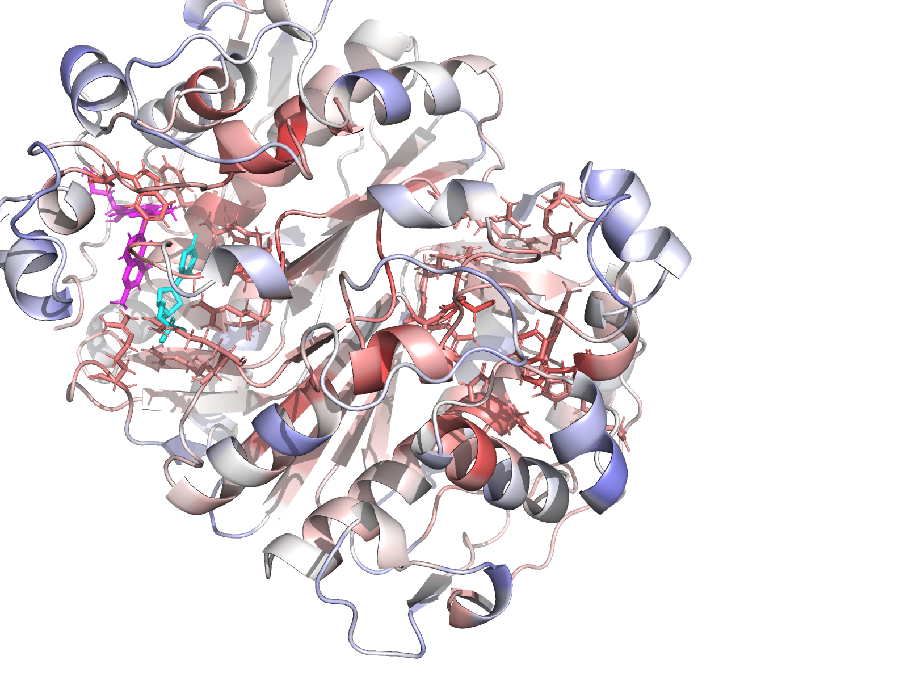

# aminak — TYMS / dUMP structural-bioinformatics workbench

Reference workflow + worked example: **human Thymidylate Synthase (TYMS, UniProt P04818)** — the molecular target of 5-fluorouracil in colorectal-cancer chemotherapy — explored end-to-end with cross-species conservation, AutoDock Vina docking against the natural substrate dUMP, a 20-mutant probe panel, and Modeller-based homology modelling. Every artefact is self-contained: HTML / PDF / DOCX reports, **96 interactive 3D viewers** (3Dmol.js, PDBs embedded inline), and a multi-format ligand & complex library.

> The full audit history (5 doer↔verifier rounds + Phase 6 audit) lives in [CHANGELOG.md](CHANGELOG.md). The reviewer reports are in `reviews/`, `reviews_v2/`, `reviews_v3/`, `reviews_v4/`, `reviews_v5/`, `reviews_phase6/`.

---

## Headline finding

> **Rigid-receptor AutoDock Vina with AD4 partial charges and the physically correct (net −2) raltitrexed cofactor cannot resolve TYMS active-site point mutants at the kcal/mol scale.** Across 20 mutants × 2 cofactor conditions, the largest holo Δ Vina score is +0.77 kcal/mol (R215A_N226A) — well below Vina's documented noise floor of ±0.85 kcal/mol (Trott & Olson 2010; Forli et al. 2016). The mutational ranking is directionally chemically sensible (R215 phosphate clamp, H196 catalytic dyad, N226 substrate orientation) but statistically silent. **Reported as a null-result methodology paper.**

Phase 6 (Modeller homology modelling) is layered on top: 10 models from 3 templates spanning **30–95 % identity** (deliberately educational, not 100 %), best-by-DOPE selection (model 3, DOPE = −35 775), best-by-Cα-RMSD (model 10, 0.367 Å vs 1HVY).

---

## 🧭 Pipeline workflow

Six phases, nine stages each in its own numbered subfolder, plus a sibling `10_modeller/` for the homology-modelling sub-pipeline. The diagram below is rendered live by GitHub's Mermaid support, so it always scales to the viewport and never clips.


[Static PNG fallback for places that don't render Mermaid](workflow_diagram_v3.png).

---

## 🗺️ Repo map

The diagram below regenerates on every push to `main` ([repo-visualizer](https://github.com/githubocto/repo-visualizer) by [GitHub Next](https://githubnext.com/projects/repo-visualization/)). A schematic placeholder is committed to the repo so this image always renders, even before the workflow has run.

<p align="center">
  <a href="docs/assets/repo-visualization.svg"></a>
</p>

---

## Live 3D structures — rotating in-page (looped GIFs) + click-through to interactive viewers

GitHub markdown strips `<script>` and `<iframe>`, so a true JavaScript-driven viewer (3Dmol.js, Mol*) cannot run **inside** this README. The closest legitimate substitute is animated GIFs (rendered with PyMOL, looped here at ~3 fps) for the in-page "interactive feel", plus click-through buttons that open the full 3Dmol.js viewer (with rotate / zoom / surface toggle / spin), or load the same PDB straight into the public Mol* viewer.

<table>
<tr><td align="center" width="33%">
<br/>
<b>WT (apo) + dUMP</b><br/>
<a href="https://ariomoniri.github.io/aminak/viewers/wt_apo_complex.html">▶ 3Dmol viewer</a> · 
<a href="https://molstar.org/viewer/?url=https://raw.githubusercontent.com/ArioMoniri/aminak/main/06e_docking_wt_v5/wt_apo_complex.pdb">▶ Mol* viewer</a>
</td>
<td align="center" width="33%">
<br/>
<b>WT (holo) + dUMP + cofactor</b><br/>
<a href="https://ariomoniri.github.io/aminak/viewers/wt_holo_complex.html">▶ 3Dmol viewer</a> · 
<a href="https://molstar.org/viewer/?url=https://raw.githubusercontent.com/ArioMoniri/aminak/main/06e_docking_wt_v5/wt_holo_complex.pdb">▶ Mol* viewer</a>
</td>
<td align="center" width="33%">
<br/>
<b>R215A_N226A holo</b> — top destabiliser<br/>
<a href="https://ariomoniri.github.io/aminak/viewers/R215A_N226A_holo_complex.html">▶ 3Dmol viewer</a> · 
<a href="https://molstar.org/viewer/?url=https://raw.githubusercontent.com/ArioMoniri/aminak/main/07e_mut_docking_v5/viewer_files/R215A_N226A_holo_complex.pdb">▶ Mol* viewer</a>
</td></tr>
</table>

Index of all 96 interactive 3Dmol viewer pages: **https://ariomoniri.github.io/aminak/viewers/index.html**

The 3Dmol viewer pages have the protein as cartoon **+ semi-transparent surface**, ligand as **fat magenta sticks**, active-site residues as labelled sticks (yellow C); catalytic Cys195 / His196 / Arg175 / Arg176 / Arg215 / Asn226 carry permanent text labels. On-page buttons toggle surface, switch to cartoon-only, zoom to ligand, and spin.

### Static thumbnails — clickable

| | | |
|:-:|:-:|:-:|
| [](https://ariomoniri.github.io/aminak/viewers/wt_apo_complex.html) | [](https://ariomoniri.github.io/aminak/viewers/wt_holo_complex.html) | [](https://ariomoniri.github.io/aminak/viewers/R215A_N226A_holo_complex.html) |
| **WT (apo) + dUMP** — reference | **WT (holo) + dUMP** — reference | **R215A_N226A holo** — top destabiliser |
| [](https://ariomoniri.github.io/aminak/viewers/H196A_holo_complex.html) | [](https://ariomoniri.github.io/aminak/viewers/R175E_R176E_holo_complex.html) | [](https://ariomoniri.github.io/aminak/viewers/T170A_holo_complex.html) |
| **H196A holo** — catalytic dyad | **R175E_R176E holo** — clamp inversion | **T170A holo** — surface control |
| [](https://ariomoniri.github.io/aminak/viewers/C195A_holo_complex.html) | [](https://ariomoniri.github.io/aminak/viewers/modeller_model03.html) | [](https://ariomoniri.github.io/aminak/viewers/modeller_model10.html) |
| **C195A** — flagged low-confidence | **Modeller model 3** — best by DOPE | **Modeller model 10** — best by RMSD |

---

## 📊 Mutation-effect 2D map (Ramachandran-style for mutations)

[](https://ariomoniri.github.io/aminak/11_enhanced/mutation_effect_2d.html)

**▶ Open the [dynamic Plotly version](https://ariomoniri.github.io/aminak/11_enhanced/mutation_effect_2d.html)** — hover for full per-mutant detail, click the legend to filter by functional class, click any point to launch its live 3Dmol viewer.

Each point is one mutant in the holo condition. **X axis**: Δ hydropathy (Kyte–Doolittle, new − WT). **Y axis**: Δ side-chain volume (ų, new − WT). **Fill colour**: Δ Vina score vs WT (red = destabilising, blue = stabilising; range narrower than Vina's ±0.85 noise floor). **Ring colour**: functional class. **Greyed marker** = mis-docked or low-confidence (excluded from clean rankings). The plot makes the headline visible: across the entire chemistry × volume plane, **no mutant produces a colour darker than the noise band**.

---

## 🔬 Conservation, active-site annotation, structural prep

| | |
|:-:|:-:|
|  |  |
| **Per-residue Jensen–Shannon conservation** (Capra–Singh, weighted window). 10 verified TYMS orthologs, MAFFT --auto, PfDHFR-TS trimmed to TS domain, >50 % gap columns excluded from ranking. Cys195/His196/Arg175/Arg176/Arg215/Asn226 all naturally in the top decile. | **DB-annotated active-site × top-25 % conservation overlap**. Intersection yields the canonical TYMS catalytic set with no force-augmentation. |

| | |
|:-:|:-:|
|  |  |
| **TYMS homodimer (chains A + B)** with chain-A dUMP highlighted. Active site sits at the dimer interface — Arg175′ / Arg176′ of chain B clamp the chain-A dUMP phosphate. | **Surface coloured by Jensen–Shannon conservation** (blue → red, low → high). The catalytic pocket aligns with the deepest red. |

| | |
|:-:|:-:|
|  |  |
| **Chain-A active-site closeup** with residue labels. | **Chain-B active site** — mirror image of chain A, since TYMS is a symmetric homodimer. |


*Cys195 – His196 catalytic dyad geometry. Cys195 is the Michael-addition nucleophile; His196 is the proton-transfer partner.*

---

## 🧱 Reference renders (chain A, surface + sticks + labelled interacting residues + mutation site)

Each mutant render shows the **interacting residues** (within 4.5 Å of dUMP — yellow C, labelled with `RES<num>`), the **mutation site** (orange, labelled `MUT <RES><num>`), the **ligand** (magenta sticks), and the **cofactor** (cyan sticks in holo). The receptor's semi-transparent **surface** is overlaid on a cartoon so the pocket geometry is unambiguous.

<table>
<tr>
<td align="center" width="50%"><br/><b>H196A holo</b> — catalytic dyad probe</td>
<td align="center" width="50%"><br/><b>H196A holo (wide context)</b> — chain B in grey</td>
</tr>
<tr>
<td align="center"><br/><b>R215A_N226A holo</b> — top destabiliser</td>
<td align="center"><br/><b>R175E_R176E holo</b> — phosphate clamp inversion</td>
</tr>
<tr>
<td align="center"><br/><b>R50A holo</b> — phosphate clamp, bulk loss</td>
<td align="center"><br/><b>R215E holo</b> — phosphate clamp, charge inversion</td>
</tr>
<tr>
<td align="center"><br/><b>C195A holo</b> — catalytic Cys (flagged low-confidence)</td>
<td align="center"><br/><b>Y258F_F225Y holo</b> — aromatic swap pair</td>
</tr>
<tr>
<td align="center" colspan="2"><br/><b>T170A holo</b> — distant-surface negative control (Δ ≈ 0)</td>
</tr>
</table>

Renders for every key mutant (close-up + wide context) are in [`11_enhanced/pymol/`](11_enhanced/pymol/).

---

## 📈 Analysis plots

| | |
|:-:|:-:|
|  |  |
| **Δ Vina by mutant category** (apo + holo overlay). | **Per-mutant Δ Vina, both conditions side-by-side**. |

| | |
|:-:|:-:|
|  |  |
| **Apo vs holo paired difference**. | **Apo vs holo concordance scatter** with the diagonal. |


*Earlier (v3) version of the mutation-effect map. The final Plotly version is up top.*

---

## 🧬 Phase 6 — Modeller homology modelling

10 models built with **Modeller 10.8 AutoModel** against 3 templates spanning **30–95 % identity** (deliberately educational, not 100 %; 1HVY itself excluded from BLAST hits):

| Template | Organism | % identity | Resolution |
| --- | --- | --- | --- |
| 3IHI_A | *Mus musculus* TYMS | 92.71 % | 1.94 Å |
| 6K7Q_A | *Penaeus vannamei* (white shrimp) TYMS | 75.96 % | 2.27 Å |
| 5H39_A | *Human gammaherpesvirus 8* (KSHV) ORF70 | 72.28 % | 2.00 Å |

**Best by DOPE** (canonical pick for blind prediction): model 3 (DOPE = −35 775).
**Best by Cα RMSD vs 1HVY**: model 10 (0.367 Å). The two criteria disagree by one rank because the two models differ in a surface loop (residues 93–101) where the templates were uninformative — exactly where a real homology-modelling exercise should differ.

### All 10 models, individually overlaid on the 1HVY crystal

<table>
<tr>
<td align="center" width="25%"><br/><b>Model 1</b></td>
<td align="center" width="25%"><br/><b>Model 2</b></td>
<td align="center" width="25%"><br/><b>Model 3</b> · ⭐ best DOPE</td>
<td align="center" width="25%"><br/><b>Model 4</b></td>
</tr>
<tr>
<td align="center"><br/><b>Model 5</b></td>
<td align="center"><br/><b>Model 6</b></td>
<td align="center"><br/><b>Model 7</b></td>
<td align="center"><br/><b>Model 8</b></td>
</tr>
<tr>
<td align="center"><br/><b>Model 9</b></td>
<td align="center"><br/><b>Model 10</b> · ⭐ best RMSD (0.367 Å)</td>
<td align="center" colspan="2"><br/><b>All 10 models + crystal</b> (overlay)</td>
</tr>
</table>

Each tile: **green** = model, **magenta** = 1HVY crystal chain-A backbone. Click any thumbnail above (or open the PNG in [`10_modeller/05_comparison/`](10_modeller/05_comparison/)) for the full-resolution render.

### Per-model Ramachandran φ/ψ plots (local PROCHECK substitute)

Local Ramachandran (Biopython φ/ψ + hand-drawn favoured/allowed polygons — calibrated against the 1HVY crystal itself, which scores 82.3 % favoured under the same scheme). Models score 83.5–85.3 % favoured / 12.6–14.4 % allowed / 1.4–2.8 % outliers — i.e. **match or beat the crystal under this scheme**. For canonical MolProbity-comparable numbers, see [`10_modeller/06_validation/SAVES_MANUAL.md`](10_modeller/06_validation/SAVES_MANUAL.md) (manual upload to https://saves.mbi.ucla.edu/).

<table>
<tr>
<td align="center" width="25%"><br/>Model 1</td>
<td align="center" width="25%"><br/>Model 2</td>
<td align="center" width="25%"><br/>Model 3</td>
<td align="center" width="25%"><br/>Model 4</td>
</tr>
<tr>
<td align="center"><br/>Model 5</td>
<td align="center"><br/>Model 6</td>
<td align="center"><br/>Model 7</td>
<td align="center"><br/>Model 8</td>
</tr>
<tr>
<td align="center"><br/>Model 9</td>
<td align="center"><br/>Model 10</td>
<td align="center" colspan="2"><br/><b>Per-model quality overview</b> (DOPE / molpdf / RMSD / Ramachandran %)</td>
</tr>
</table>

### Per-residue DOPE energy profile (best by DOPE, model 3)


Peaks in the per-residue DOPE highlight modelling-uncertain regions (the residue-93–101 loop visible in the overlay). Profiles for the other 9 models are in [`10_modeller/06_validation/`](10_modeller/06_validation/).

### Open any Modeller model in 3Dmol or Mol*

| Model | Best by | 3Dmol viewer | Mol* viewer |
| --- | --- | --- | --- |
| `target.B99990001` | — | [▶](https://ariomoniri.github.io/aminak/viewers/modeller_model01.html) | [▶](https://molstar.org/viewer/?url=https://raw.githubusercontent.com/ArioMoniri/aminak/main/10_modeller/04_modeller_run/models/target.B99990001.pdb) |
| `target.B99990003` | ⭐ DOPE | [▶](https://ariomoniri.github.io/aminak/viewers/modeller_model03.html) | [▶](https://molstar.org/viewer/?url=https://raw.githubusercontent.com/ArioMoniri/aminak/main/10_modeller/04_modeller_run/models/target.B99990003.pdb) |
| `target.B99990010` | ⭐ Cα RMSD vs 1HVY | [▶](https://ariomoniri.github.io/aminak/viewers/modeller_model10.html) | [▶](https://molstar.org/viewer/?url=https://raw.githubusercontent.com/ArioMoniri/aminak/main/10_modeller/04_modeller_run/models/target.B99990010.pdb) |
| `best_model.pdb` | DOPE pick copy | — | [▶](https://molstar.org/viewer/?url=https://raw.githubusercontent.com/ArioMoniri/aminak/main/10_modeller/04_modeller_run/models/best_model.pdb) |

Phase 6 source: [`10_modeller/`](10_modeller/) and [`scripts/modeller/`](scripts/modeller/). Full Phase-6 DOCX: [`09e_report_v5/report_PHASE6.docx`](09e_report_v5/report_PHASE6.docx). Phase-6 reviewer reports: [`reviews_phase6/`](reviews_phase6/).

---

## Reports (every format)

| Format | Path | Size |
| --- | --- | --- |
| **HTML** (self-contained, embedded PNGs) | [`09e_report_v5/report.html`](09e_report_v5/report.html) | 245 KB |
| **PDF** (WeasyPrint) | [`09e_report_v5/report.pdf`](09e_report_v5/report.pdf) | 252 KB |
| **DOCX (final, with caption fixes)** | [`09e_report_v5/report_FINAL.docx`](09e_report_v5/report_FINAL.docx) | 5.7 MB |
| **DOCX (Phase 6 — Modeller)** | [`09e_report_v5/report_PHASE6.docx`](09e_report_v5/report_PHASE6.docx) | 6.7 MB |
| **Master log** | [`pipeline.log`](pipeline.log) | — |
| **Master numerical table (v5)** | [`07e_mut_docking_v5/mutant_results_v5.csv`](07e_mut_docking_v5/mutant_results_v5.csv) | — |

---

## Multi-format ligand & complex library (drag into your viewer of choice)

```
05b_ligand_v2/
├── dump.pdb         (crystal dUMP, plain PDB)
├── dump.mol2        (Tripos / Sybyl)
├── dump.sdf         (RDKit-friendly)
└── dump.pdbqt       (Vina-ready)

03e_structure_v5/
├── cofactor_chainA_v5.pdb / chainB_v5.pdb   (in-place reprotonated raltitrexed)
└── cofactor_provenance_v5.json               (full reprotonation provenance)

06e_docking_wt_v5/
├── protein_dimer_apo.pdbqt / holo.pdbqt     (chains A+B; Gasteiger charges)
├── protein_dimer_holo.pdb                    (chains A+B + v5 cofactor)
├── wt_{apo,holo}.pdbqt                       (Vina output, all modes)
├── wt_{apo,holo}_top_pose.pdb                (top mode, atom names preserved)
└── wt_{apo,holo}_complex.pdb                 (receptor + top pose, single PDB)

07e_mut_docking_v5/viewer_files/
├── <mut>_<cond>_top_pose.pdb                 (40 files: 20 mutants × {apo, holo})
└── <mut>_<cond>_complex.pdb                   (receptor + top pose)

10_modeller/04_modeller_run/models/
└── target.B99990001.pdb … target.B99990010.pdb
    + best_model.pdb (best by DOPE)
```

Drag any `*_complex.pdb` into PyMOL / ChimeraX / VMD — receptor + top dUMP pose load together.

---

## Mutational panel rationale

Each mutation probes a specific mechanistic hypothesis. Multiple substitutions per critical residue discriminate "side-chain identity matters" from "side-chain bulk matters".

| Class | Residue / Pair | Substitution(s) | Mechanistic question |
| --- | --- | --- | --- |
| Catalytic | Cys195 | →Ala, →Ser | Loss of nucleophilic thiol vs replacement with smaller polar OH |
| Catalytic | His196 | →Ala, →Phe | Removal of imidazole H-bond donor vs non-polar aromatic |
| Substrate orientation | Asn226 | →Ala, →Asp | H-bond donor loss vs charge inversion |
| Substrate orientation | Tyr258 | →Ala, →Phe | Loss of OH vs aromatic only |
| Phosphate clamp | Arg50 | →Ala, →Glu | Bulk loss vs charge inversion |
| Phosphate clamp | Arg175 | →Ala, →Glu | Bulk loss vs charge inversion |
| Phosphate clamp | Arg176 | →Ala, →Glu | Bulk loss vs charge inversion (paired with R175) |
| Phosphate clamp | Arg215 | →Ala, →Glu | Bulk loss vs charge inversion |
| Pocket scaffold | Phe80 | →Ala, →Asp | Hydrophobic loss vs hydrophilic introduction |
| Pocket scaffold | Phe225 | →Ala, →Asp | Hydrophobic loss vs hydrophilic introduction |
| Pocket scaffold | Trp109 | →Ala | Bulk loss |
| Pocket scaffold | Gln214 | →Ala | Side-chain loss |
| Pocket scaffold | Asp218 | →Ala, →Lys | Negative→neutral vs negative→positive |
| Catalytic dyad | Cys195+His196 | C195A_H196A & C195S_H196N | Synergy vs polar-neutral compensator |
| Phosphate clamp pair | Arg175+Arg176 | R175E_R176E | Both arginines flipped |
| Aromatic swap pair | Tyr258+Phe225 | Y258F_F225Y | Aromatic identity exchange |
| Substrate orientation pair | Asp218+Asn226 | D218N_N226D | Mutual charge exchange |
| Negative control | Thr170 | →Ala | Surface residue ≥ 18 Å from active site (should give Δ ≈ 0) |

T170A control: holo Δ = +0.17 — pipeline does not produce false positives at distant surface residues.

---

## Phase 6 — Homology modelling (Modeller)

10 models built with Modeller 10.8 AutoModel against 3 templates with **30–95 % identity** (educational, not 100 %; 1HVY itself excluded from BLAST hits):

| Template | Organism | % identity | Resolution |
| --- | --- | --- | --- |
| 3IHI_A | *Mus musculus* TYMS | 92.71 % | 1.94 Å |
| 6K7Q_A | *Penaeus vannamei* (white shrimp) TYMS | 75.96 % | 2.27 Å |
| 5H39_A | *Human gammaherpesvirus 8* (KSHV) ORF70 | 72.28 % | 2.00 Å |

**Best by DOPE** (the canonical pick for blind prediction): model 3 (DOPE = −35 775).
**Best by Cα RMSD vs 1HVY**: model 10 (0.367 Å). The two criteria disagree by one rank because they differ in a surface loop (residues 93–101) where the templates were uninformative — exactly where a real homology-modelling exercise should differ.

Local Ramachandran (favoured 83.5–85.3 %, allowed 12.6–14.4 %, outliers 1.4–2.8 %) is computed via Biopython φ/ψ + a hand-drawn polygon classifier; SAVES web (PROCHECK / ERRAT / VERIFY3D / WHATCHECK) is documented as a manual upload step in [`10_modeller/06_validation/SAVES_MANUAL.md`](10_modeller/06_validation/SAVES_MANUAL.md).

Phase 6 source: [`10_modeller/`](10_modeller/) and [`scripts/modeller/`](scripts/modeller/). Full DOCX: [`09e_report_v5/report_PHASE6.docx`](09e_report_v5/report_PHASE6.docx).

---

## How to reproduce

```bash
# Native binaries (Homebrew on macOS arm64)
brew install mafft open-babel pymol glew libxml2 clustal-w blast
brew install brewsci/bio/autodock-vina    # also pulls boost@1.85

# Modeller 10.8 (free academic licence — register at https://salilab.org/modeller/)
# Then export KEY_MODELLER=<your-key>   (or use the historical academic key)

# Python environment
pyenv install 3.11.9
python3.11 -m venv .venv && source .venv/bin/activate
pip install -r requirements.txt

# Run the layered pipeline (each version skips its outputs if present)
source 00_setup/env.sh
for s in scripts/stage*.py;          do python "$s"; done   # v1
for s in scripts/v2/stage*.py;       do python "$s"; done   # v2
for s in scripts/v3/stage*.py;       do python "$s"; done   # v3
for s in scripts/v4/stage*.py;       do python "$s"; done   # v4
for s in scripts/v5/stage*.py;       do python "$s"; done   # v5 (final docking phase)
for s in scripts/modeller/step*.py;  do python "$s"; done   # Phase 6 (Modeller)

# Build viewers + final DOCX + enhanced renders
python scripts/v2/build_viewers.py
python scripts/v5/build_final_docx.py
python scripts/v5/build_enhanced_renders.py
```

Full installed-library manifest in [`00_setup/installed_libraries.md`](00_setup/installed_libraries.md), literal pip freeze in [`00_setup/pip_freeze.txt`](00_setup/pip_freeze.txt).

---

## Licence

[MIT](LICENSE), © 2026 Ariorad Moniri. Bundled third-party data (RCSB PDB structures, UniProt sequences, RCSB CCD coords, 3Dmol.js library) retain their original licences — see [LICENSE](LICENSE).
